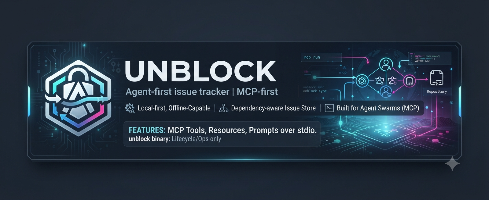

# unblock

**Agent-first issue tracker — MCP-first.** A local-first, offline-capable, dependency-aware issue
store built for agent swarms. Every domain feature is a Model Context Protocol (MCP) tool, resource,
or prompt over stdio; the `unblock` command-line binary is lifecycle/ops only.

[](#license)

> A ground-up, idiomatic, multi-crate **Rust** tool. GA
> **1.0.0** — semver stability applies from GA (D35): the MCP contract, CLI surface, and 0–8 exit
> codes are stable; a breaking change bumps to 2.0.0.

## What is unblock

unblock is the issue store an agent swarm can coordinate through without a server, an account, or the
internet. Issues, dependencies, and atomic multi-agent claims live in a local database; agents drive
everything over MCP.

> unblock is the only local, offline-capable, dependency-aware issue store with atomic multi-agent
> claim, a versioned dependency-aware scheduler, and contention-safe swarm coordination at 250k+
> issues — no accounts, no internet, with a credible shared-state path via libsql sync.

Persistence is a [libsql](https://github.com/tursodatabase/libsql) (Turso's SQLite fork) database —
the source of truth, behind a `Storage` trait, local-file by default with a native path to
remote/replicated sync later. A line-oriented **JSONL** export/import is an optional, git-diffable
portability/audit feature, not a sync mechanism.

## Why unblock

- **Swarm-scale correctness.** Contention-safe coordination and integrity at 250k+ issues, proven by
  a dedicated contention lab and a 250k-issue scale gate in CI (NFR-1/2/3 — see
  [ci-cd-and-distribution.md](docs/plans/ci-cd-and-distribution.md) §5).
- **Atomic multi-agent claim.** The `claim` tool assigns an issue and flips it to `in_progress` in one
  atomic step, so two agents never grab the same work.
- **Offline-first.** No git operations, no git library linked, and no network on any normal command
  path — the only network access is the explicit `unblock update`.
- **Dependency-aware scheduler.** A real dependency graph (`petgraph`) drives ready/blocked ordering,
  cycle detection, and a versioned scheduler, so agents pick genuinely unblocked work.

Compared to alternatives: a GitHub MCP server needs internet + an account and has no dependency graph
or atomic claim; `saga-mcp` has no atomic claim and is single-agent; a raw SQLite MCP has no domain
model and no exit-code contract.

## Install

Prebuilt installers are produced by [`dist`](https://github.com/axodotdev/cargo-dist) for five target
triples (`x86_64`/`aarch64` on linux-gnu and macOS, `x86_64` on windows-msvc) — a single self-contained binary
with no runtime system dependencies.

**Shell (Linux / macOS):**

```sh
curl --proto '=https' --tlsv1.2 -LsSf https://github.com/websublime/unblock/releases/latest/download/unblock-cli-installer.sh | sh
```

**PowerShell (Windows):**

```powershell
powershell -ExecutionPolicy Bypass -c "irm https://github.com/websublime/unblock/releases/latest/download/unblock-cli-installer.ps1 | iex"
```

> The installer artifacts are named `unblock-cli-*` (dist derives the release App name from the
> `unblock-cli` package) even though the installed binary is `unblock`. The `releases/latest/download/`
> links resolve once the maintainer cuts the first published release; a version-pinned form such as
> `.../releases/download/v1.0.0/unblock-cli-installer.sh` also works.
>
> The installer adds `unblock` to your `PATH` by editing your shell profile — open a new terminal (or
> `source` the env file it prints) before running the `unblock` commands below, or you'll hit
> "command not found".

**Build from source** (alternative):

```sh
cargo build --release   # stable Rust 1.96.0, edition 2024 → target/release/unblock
```

> `cargo install unblock` is **not** available: every workspace crate — including the binary crate
> `unblock-cli` — is `publish = false`, and there is no `unblock` crate on crates.io. Only the dist
> installers or a from-source build produce the binary.

## Quickstart — wire into an MCP client

unblock's product surface is MCP, so the goal is to get an MCP client spawning the stdio server.

1. **Scaffold a workspace.** From your **project root**, create a `.unblock/` directory holding
   `config.toml` (with the issue-id prefix seeded — default `ub`) and a migrated, empty `unblock.db`.
   Idempotent and clobber-guarded.

   ```sh
   unblock init                 # or: unblock init --prefix myproj
   ```

2. **Write the agent wiring block.** Writes/refreshes a managed block in `AGENTS.md` (delimited by
   `<!-- BEGIN unblock -->` / `<!-- END unblock -->`) documenting the full MCP surface — tool,
   resource, and prompt tables, the per-action parameter surface, the error-code/exit table, and the
   contract id. This is the machine-facing wiring doc for agents in the workspace.

   ```sh
   unblock agents
   ```

3. **Register the server with your MCP client.** Point the client at the `unblock` binary over stdio.
   **How you point at the workspace depends on where the config lives** — a config committed to the repo
   (shared with your team) must NOT carry a machine-specific absolute path, while a per-user config that
   lives outside any repo does need one. Pick the world that matches your client.

   **A) Project-scoped, committed config (the default for a team).** These configs live inside the repo
   and are committed, so every teammate on every machine gets the same wiring. They pass **no absolute
   path**: `unblock` resolves the workspace from `CLAUDE_PROJECT_DIR` (which Claude Code sets in the
   server's environment and `unblock` reads on startup), or from the working directory (VS Code / Cursor
   set it to the workspace), falling back to a walk-up.

   Claude Code — `.mcp.json` at the repo root:

   ```json
   {
     "mcpServers": {
       "unblock": {
         "command": "unblock",
         "args": ["mcp"]
       }
     }
   }
   ```

   Do **not** write `"args": ["mcp", "--dir", "${CLAUDE_PROJECT_DIR}"]`: the `${…}` form is **not**
   expanded inside `.mcp.json` (the variable lives in the spawned child's env, not a token Claude Code
   substitutes into `args`), so it would reach `unblock` verbatim and fail. Omitting `--dir` is the
   correct, committable form.

   VS Code — `.vscode/mcp.json`, pinning the working directory to the workspace folder:

   ```json
   {
     "servers": {
       "unblock": {
         "type": "stdio",
         "command": "unblock",
         "args": ["mcp"],
         "cwd": "${workspaceFolder}"
       }
     }
   }
   ```

   Cursor — `.cursor/mcp.json`; the path-free form is preferred (Cursor sets the working directory to the
   project, and the walk-up finds `.unblock/`):

   ```json
   {
     "mcpServers": {
       "unblock": {
         "command": "unblock",
         "args": ["mcp"]
       }
     }
   }
   ```

   If your Cursor version does not set the working directory to the project, use `"args": ["mcp", "--dir",
   "${workspaceFolder}/.unblock"]` — but only if your Cursor expands `${workspaceFolder}` before spawning
   (it resolves to each developer's own checkout, so the file stays portable); if it does not expand, drop
   `--dir` and let the walk-up resolve it. Never commit a literal machine path here.

   **B) User-global config, not committed (Claude Desktop).** Claude Desktop's config is per-user, lives
   outside any repo (`~/Library/Application Support/Claude/claude_desktop_config.json` on macOS), sets no
   `CLAUDE_PROJECT_DIR`, and is often spawned from `$HOME` — so an **absolute** `--dir` is the correct and
   expected form here. Use the absolute path to the `.unblock` directory created in step 1 (the output of
   `pwd` in your project root, followed by `/.unblock`):

   ```json
   {
     "mcpServers": {
       "unblock": {
         "command": "unblock",
         "args": ["mcp", "--dir", "/absolute/path/to/project/.unblock"]
       }
     }
   }
   ```

   > **If the client can't find `unblock`:** GUI-launched clients (e.g. Claude Desktop) do not inherit
   > your interactive shell `PATH`, and the installer places `unblock` in a per-user directory. If the
   > server fails to start (spawn `ENOENT`), replace `"command": "unblock"` with the absolute path from
   > `which unblock` (macOS/Linux) or `where.exe unblock` (Windows).

4. **Let the client spawn the server.** On startup the client launches `unblock mcp` as a stdio child and
   speaks MCP to it. `unblock` resolves the workspace in this order: an explicit `--dir`/`--db` (or
   `UNBLOCK_DIR`), then `CLAUDE_PROJECT_DIR` from its environment, then a bounded walk-up from the working
   directory to the nearest `.unblock/`. Prefer one of the project-scoped forms above (or an absolute
   `--dir` for a user-global client) rather than relying on the walk-up alone. On startup `unblock` reports
   the workspace directory it bound **to stderr** (diagnostics only, NFR-14) — check that line to confirm
   it opened the workspace you expected.

The contract id is **`unblock.mcp.v1.7`**. For machine-readable discovery, agents read the resources
`unblock://capabilities` (the descriptor tables) and `unblock://schema` (the full JsonSchema bundle
for every tool I/O). The topology is **child-per-client** (D31): each MCP client spawns its own
`unblock mcp` child, and a cross-process advisory `.unblock/.write.lock` serializes writers across
clients.

## MCP surface

The contract (`unblock.mcp.v1.7`) exposes **8 tools**, **5 resources**, and **3 prompts**.

| Tool | Actions |
|---|---|
| `issue` | `create` · `show` · `update` · `close` · `reopen` · `delete` · `restore` (plus `create_bulk` from markdown, quick-create) |
| `claim` | atomic assignee + flip to `in_progress` |
| `defer` | `defer` · `undefer` |
| `query` | `list` · `ready` · `blocked` · `search` · `count` · `stale` (with filters) |
| `dep` | `add` · `remove` · `list` · `tree` · `cycles` · `graph` |
| `sync` | `export` · `import` · `import_bd` (one-shot bd import) |
| `diagnostics` | `stats` · `info` · `where` · `version` · `lint` · `changelog` · `orphans` |
| `comment` | `add` · `list` · `update` · `delete` (soft-redact: the row is kept, the body masked) |

**Resources:** `unblock://issues/{id}` · `unblock://issues/ready` · `unblock://issues/blocked` ·
`unblock://capabilities` · `unblock://schema`.

**Prompts:** `triage` · `plan_next_work` · `close_with_suggestions`.

The full per-action parameter surface (required and optional fields for every action) lives in the
generated `AGENTS.md` block and in the `unblock://capabilities` / `unblock://schema` resources — read
those rather than duplicating the ~40-row table here.

## Command-line reference

The `unblock` binary is lifecycle/ops only — domain features are MCP tools. Seven commands:

| Command | Description |
|---|---|
| `unblock mcp` | Run the MCP stdio server (the primary product surface, FR-20) |
| `unblock migrate` | Ensure the workspace database schema is current and report the from→to delta (FR-16) |
| `unblock doctor` | Run read-only health diagnostics on the workspace (doctor-lite, FR-16) |
| `unblock version` | Print version / build metadata (no workspace, no network) |
| `unblock init` | Scaffold a new `.unblock/` workspace (config + migrated empty database, FR-14) |
| `unblock agents` | Write / refresh the managed `AGENTS.md` MCP-wiring block (FR-14) |
| `unblock update` | Self-update the `unblock` binary (checksum-verified before swap, FR-25/D17) |

Command-specific flags: `init` takes `--prefix <PREFIX>` and `--force`; `update` takes `--dry-run`;
`version` takes `--short`.

**Global options** (present on every subcommand):

- `--dir <DIR>` [env `UNBLOCK_DIR`] — the explicit workspace `.unblock/` directory (no walk-up;
  `--dir` > `UNBLOCK_DIR`). When neither is set, `unblock` reads `CLAUDE_PROJECT_DIR` from its environment
  (injected by editors such as Claude Code, probed as a project root) and, failing that, walks up from the
  working directory to the nearest `.unblock/`. Precedence: `--db` > `--dir`/`UNBLOCK_DIR` >
  `CLAUDE_PROJECT_DIR` > bounded cwd walk-up.
- `--actor <ACTOR>` [env `UNBLOCK_ACTOR`] — the actor override.
- `-o, --output <FORMAT>` — one of `json|robot|plain|csv|markdown`.
- `-v` / `-vv` / `-vvv` — increase verbosity (INFO/DEBUG/TRACE; logs go to **stderr only**, NFR-14);
  `-q` quiets all but errors.
- `-h, --help` · `-V, --version`.

**Exit codes** — a stable 0–8 contract: `0` ok · `1` internal · `2` workspace/db · `3` not-found/id ·
`4` validation · `5` dependency/cycle · `6` sync/path · `7` config · `8` io/json. The full
code → exit → retryable table is in the generated `AGENTS.md` and in `unblock://capabilities`.
Structured output goes to **stdout**; diagnostics go to **stderr** (NFR-14).

## Self-update

```sh
unblock update            # download, verify, and swap the binary
unblock update --dry-run  # report an available update without swapping
```

`unblock update` runs the dist installer via [`axoupdater`](https://github.com/axodotdev/axoupdater),
which verifies each artifact's **SHA256** checksum against `dist-manifest.json` **before** `self_replace`
swaps the binary — a mismatched or tampered download is refused and nothing is swapped (NFR-17/D17).
The command lives behind the default-on **`self-update`** Cargo feature; `--no-default-features` drops
it (and with it the only network surface). No network is touched on any normal command path — only on
explicit `unblock update`.

## Architecture

unblock is an acyclic, multi-crate Rust workspace: layers **L0 → L7** (`model`/`error` → `policy` →
`storage` → `sync`/`health` → `config` → `engine` → `render` → `mcp`/`cli`), with edges pointing
downward only (enforced by `cargo xtask check-layering`, NFR-15). A single binary — `unblock` (from
`unblock-cli`) — ships; every `unblock-*` library crate is workspace-internal (`publish = false`). See
[`crates/README.md`](crates/README.md) for the per-crate layering table.

## Releasing

Releases are cut by pushing a `vX.Y.Z` tag, which fires the `dist`-generated release workflow. The
maintainer runbook — including the guarded `cargo xtask release` helper and the first GA cut — is in
[`RELEASING.md`](RELEASING.md). The authoritative pipeline detail is
[`docs/plans/ci-cd-and-distribution.md`](docs/plans/ci-cd-and-distribution.md) §3.

## Documentation

- Product truth & decisions: [`docs/PRD.md`](docs/PRD.md)
- Plans, task DAG, and live status: [`docs/plans/`](docs/plans/) — notably
  [`STATUS.md`](docs/plans/STATUS.md) and
  [`implementation-plan.md`](docs/plans/implementation-plan.md)
- Workspace contract: [`CLAUDE.md`](CLAUDE.md)

## License

Licensed under either of

- MIT license ([LICENSE-MIT](LICENSE-MIT)), or
- Apache License, Version 2.0 ([LICENSE-APACHE](LICENSE-APACHE))

at your option.

Unless you explicitly state otherwise, any contribution intentionally submitted for inclusion in this
work by you, as defined in the Apache-2.0 license, shall be dual licensed as above, without any
additional terms or conditions.
