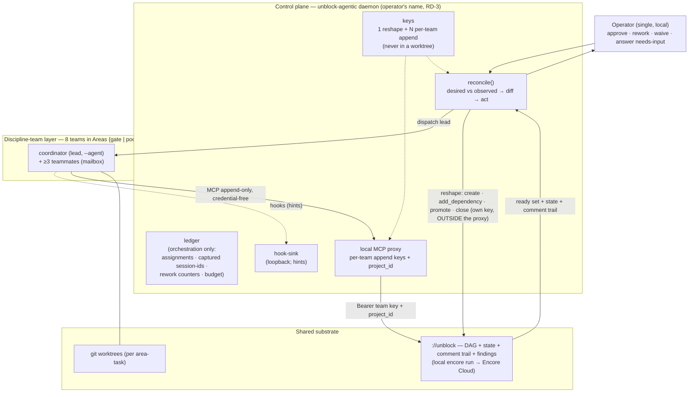
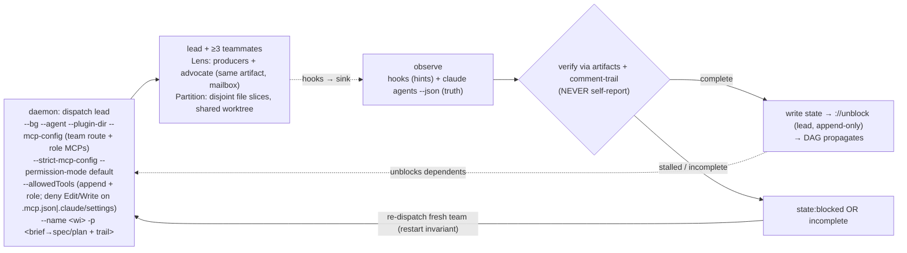

# PRD: `unblock-agentic` — DAG-Driven Control Plane for the mister-anderson Pipeline

**Status:** DRAFT
**Author:** Grace (product-manager)
**Date:** 2026-06-18
**Companion:** [docs/MANIFESTO.md](../MANIFESTO.md) (APPROVED, 2026-05-07) — the 8 governing Laws this product respects
**Authoritative design input:** `/tmp/unblock-agentic-design-v2.md` (design LOCKED 2026-06-17, RD-1…RD-6 ratified)
**Sibling product PRD:** [docs/PRD.md](../PRD.md) — `://unblock` v1.0; `unblock-agentic` is a SEPARATE post-v1.0 product, not part of P01–P04.

> **Product boundary (read first).** `unblock-agentic` is a **separate, post-v1.0 product** delivered as its own crate `crates/unblock-agentic`. It is **additive** on top of two things that already exist or are being built in `://unblock`: (1) the deployed backend MCP surface, and (2) the `unblock-render` packaged Claude Code plugin. It is **NOT a replacement for P04** (the renderer), it is **OFF the v1.0 launch path**, and its own **P0–P3 phase ladder is distinct from the `://unblock` P01–P05 phases** — the two numbering schemes never overlap. Single operator, local daemon, Claude-only. `bd`/beads/Dolt is the orchestrator's internal dev tool and is **NEVER** part of this product's runtime.

---

## 1. Problem Statement

`mister-anderson` today is a **sequential, human-stepped pipeline** inside a single Claude Code session: Product → Specification → Implementation, with named personas (Grace, Ada, Smith, Sherlock, Fernando, Linus, Quinn, Daphne) and human quality gates. It works, and the discipline it enforces (Manifesto Law 8) is exactly the value. But it serialises everything: one persona at a time, one work item at a time, one human keystroke between each stage. The `://unblock` dependency DAG already knows which work items are *ready* in parallel — the pipeline simply never exploits that parallelism.

The concrete failure modes observed today:

1. **Serial execution of a parallelisable graph.** `://unblock` computes a `ready` set — potentially many independent work items unblocked at once — but the human-stepped pipeline drains them one at a time. Throughput is bounded by the operator's attention, not by the graph's true critical path.
2. **No control plane over the agents.** Claude Code provides the orchestration *primitives* — agent teams (background `--bg` sessions with in-process teammates and a native mailbox), the `claude agents --json` truth source, hooks, and the rendered `unblock` plugin's personas. It does **not** provide a multi-team-with-coordinators hierarchy (teams cannot nest; one team has exactly one fixed lead) and it does **not** provide a DAG-driven reconciler. That missing layer is what an operator must perform by hand.
3. **Self-report cannot be trusted.** A headless agent confabulates "done" (empirically observed 2026-06-17). Without an external observer that verifies completion against the work-item artifacts and the comment trail, an orchestrator that believes the agent's self-report ships unfinished work.
4. **Single-writer to the graph is a human discipline, not a guardrail.** When many agents run concurrently, nothing in the backend stops a teammate from reshaping the dependency graph (the backend's authorization grants identical read+write to every agent regardless of `agent_kind`). Concurrency without a write-surface convention corrupts the very DAG the scheduler depends on.

`unblock-agentic` is the missing control plane: a **reconciler daemon** (Kubernetes-controller style) that parallelises the mister-anderson pipeline over the `://unblock` dependency DAG, keeps the personas and the gates and the quality bar, and adds the scheduling, single-writer discipline, completion-verification, and human-gate machinery that Claude Code alone does not provide.

---

## 2. Objectives

- **OBJ-1.** Run the eight mister-anderson discipline teams **in parallel**, scheduled by the `://unblock` dependency DAG, so that throughput tracks the graph's critical path rather than the operator's attention span.
- **OBJ-2.** Operate as a **reconciler**: a single idempotent control loop that compares desired state (the DAG) against observed state (`claude agents --json` + `://unblock` + buffered hooks), acts on the diff, and self-heals after a missed event or a daemon restart — at **work-item granularity**, never trusting in-memory state as truth.
- **OBJ-3.** Verify completion **via the work-item artifacts and the comment trail, never the agent's self-report**, so an orchestrator cannot be fooled by a confabulated "done".
- **OBJ-4.** Enforce **single-writer to the `://unblock` write surface** as an orchestration convention — only the team lead talks to `://unblock` (append-only), the reshape set is daemon-only, agents are credential-free, worktree isolation is the real containment — without requiring a backend change.
- **OBJ-5.** Give the single operator **human gates with a formal close-and-cascade**, an explicit `needs-input` escape valve distinct from a planned gate, and a report surface to Approve / Rework / Waive — keeping the human in the loop without making the human the bottleneck for the parallel parts.
- **OBJ-6.** **Delegate all Claude Code configuration to `unblock-render`** (the daemon supplies `--plugin-dir`, never re-authors `.claude/`), so the three-layer pipeline enforcement (Manifesto Law 8) survives under parallel orchestration.

---

## 3. Target Users

### 3.1 Primary persona — the Operator (human-in-the-loop)

A single operator (Miguel) who starts the daemon, approves or reworks or waives gates, answers `needs-input` questions, and tunes the concurrency budget. The operator does **not** dispatch agents by hand or step the pipeline; they supervise a fleet that the daemon schedules. The daemon runs **locally, in the operator's name** — its `://unblock` keys are issued to the operator's real user, not to a synthetic service principal (RD-3). Multi-operator and governance are explicitly post-v1.

### 3.2 Secondary persona — the discipline teams (autonomous workers)

The eight mister-anderson teams the daemon dispatches. Each team is a Claude Code background agent-team: a coordinator (the team lead, dispatched via `--agent`) plus ≥3 live teammates spawned from the rendered plugin's persona agent-types. Teammates produce artifacts and debate via the native mailbox; only the lead talks to `://unblock`. Teams are credential-free.

---

## 4. Architecture — the three-layer control plane

`unblock-agentic` is a **reconciler / control-plane daemon** that sits between the operator and the running agent fleet. Three layers:

1. **Control plane** — the `unblock-agentic` daemon: the reconciler (`reconcile()`), the orchestration ledger, the local MCP proxy, and the hook-sink. This is the daemon's own private state and logic.
2. **Discipline-team layer** — the eight teams, each a Claude Code background agent-team (a coordinator lead + ≥3 teammates), grouped into **Areas** (the gate/pool grouping — see §7).
3. **Shared substrate** — `://unblock` (the dependency DAG, work-item state, the comment trail, findings) reached over remote MCP, plus per-area-task **git worktrees** for isolation. The substrate is **local `encore run`** for P0–P2 and cuts over to **Encore Cloud** once the backend is deployed (see §11).



**Governing-Law alignment.** The daemon must respect the eight Manifesto Laws (full mapping in §10.3). The load-bearing ones:

- **Law 3 (Postgres is the source of truth).** The daemon's ledger is orchestration state, never domain truth; on conflict, `://unblock` + `claude agents --json` win over buffered hooks. Backend-unreachable is a degraded mode the daemon must handle, not work around (see Open Questions §13).
- **Law 4 (BFF is structural).** The daemon holds the keys and POSTs server-side; agents are credential-free. The report/approval surface must not put a backend credential in a browser (the surface shape is an Open Question — §13).
- **Law 6 (decoupled deliverables share no runtime state).** `unblock-agentic` shares **zero runtime state** with `unblock-code` (the AST CLI). Its data plane is exclusively `://unblock` via MCP. The AST CLI's "no daemon, no watcher" invariant (root FR-27) is an AST-CLI-only property and does not contradict this product (see §13).
- **Law 8 (three-layer pipeline enforcement).** The daemon's Stop-hook sink is **additive** to the renderer's `verify-state` hook; it dispatches renderer-produced personas; it never re-authors `.claude/`. All three enforcement layers survive parallel orchestration (see §9, T3).

---

## 5. Functional Requirements

FR numbering is local to this PRD (it does not continue the root `docs/PRD.md` sequence; the two are sibling products).

### 5.1 Reconciler (control loop)

- **FR-1.** The daemon runs `reconcile()` as a **reconciler**: compare desired state (the DAG) against observed state, act on the diff. Triggered both **event-driven** (a hook arrives at the sink) **and** on a **periodic tick** (self-heal).
- **FR-2.** `reconcile()` is a single **idempotent** pass, phased: *observe → reconcile-ledger (correlate hints to truth) → diff → act*. Running it twice with no intervening change produces no additional side effects.
- **FR-3.** **Truth precedence:** on conflict, `claude agents --json` and `://unblock` win over hooks. Hooks are hints; they may lag or be missed.
- **FR-4.** The reconciler works at **work-item granularity**. Each work item, given its observed state, is driven toward its next lifecycle state (§8).
- **FR-5.** **Restart invariant.** On restart the daemon does **not** re-adopt teammates (teammates do not resume — a documented Claude Code limitation). It re-reads work-item state and **re-dispatches a fresh team** if the area-task is incomplete. The resulting wasted work is bounded and accepted; task-lag and premature-lead-shutdown are mitigated by the `TeammateIdle`/`TaskCompleted` hooks plus artifact verification (FR-13).

### 5.2 Scheduling

- **FR-6.** `://unblock`'s `ready` set is the **readiness oracle**. The daemon does **not** reimplement topological scheduling — it reads readiness from the DAG.
- **FR-7.** The daemon adds **routing** (work item → team, by stage/labels), a **concurrency ceiling** (see §5.9), **human gates** (§5.6), and **priority** on top of `ready`.
- **FR-8.** Completing a work item (its artifacts verified, its state written) propagates through the DAG: closing a blocker unblocks its dependents. The daemon does not hand-walk the graph; the backend cascade plus the daemon's `promote` (FR-21) recover newly-ready items.

### 5.3 Dispatch / session birth

- **FR-9.** A dispatch is at the granularity of an **area-task** (a work item routed to its team). Dispatch creates a **git worktree** named after the work item — the unit of isolation, config, and correlation.
- **FR-10.** The daemon provisions per dispatch: the rendered plugin (via `--plugin-dir`, **never** re-authoring `.claude/`), a curated MCP set (the unblock proxy route for the lead plus role-appropriate read MCPs), and a **brief** composed from `://unblock`. The brief **MUST point to the spec/plan and the comment trail and NEVER inline an authoritative copy** (the bead-description-is-not-the-spec rule).
- **FR-11.** The daemon **dispatches the lead** as a background agent-team. `--bg` rejects a caller-supplied session id, so the daemon **captures** the generated session id (from `--bg` output / `claude agents --json`), correlates it by `--name`/`--cwd`, and persists it in the ledger.
- **FR-12.** Dispatch **records the assignment in the ledger immediately** (idempotency; prevents double-dispatch). The ledger is orchestration-only state — assignments, captured session-ids, rework counters, budget — never domain truth.
- **FR-13.** The daemon **observes** via hooks (`SessionStart`, `Stop`, `SubagentStop`, `TeammateIdle`, `TaskCompleted`) plus `claude agents --json`, and **verifies completion via the work-item artifacts and the comment trail — NEVER the agent's self-report.**
- **FR-14.** The daemon must detect a headless session **stalled in `state:blocked`** (a too-tight permission allowlist with no human to approve) as a **failure**, and either re-dispatch or surface `needs-input` (§5.6). The daemon uses `--permission-mode default` with a complete `--allowedTools` allowlist; it **never** launches a lead with `bypassPermissions` / `--dangerously-skip-permissions` (that mode propagates to every teammate).
- **FR-15.** **Permissions = authority.** The provisioned `--allowedTools` allowlist defines each team's capability boundary. Agents cannot escalate beyond it. The allowlist denies `Edit`/`Write` on `.mcp.json` and `.claude/settings` (anti-escape), and `--strict-mcp-config` restricts the session to exactly the daemon-provisioned MCP set (which INCLUDES the useful role MCPs — it is "only the daemon-provisioned set", not "only unblock").

### 5.4 Hooks

- **FR-16.** Each session's hooks POST events to the daemon's loopback **hook-sink** via a small `unblock-hook` shim that forwards Claude Code's event payload plus the `--name` (work-item) correlation key. Events are deduplicated.
- **FR-17.** The daemon's Stop-hook command **must differ from the renderer's `verify-state` Stop-hook command** so that both fire (Claude Code dedupes Stop hooks by command string). The daemon's sink is additive; the renderer's Layer-2 finding still emits under daemon orchestration (§9, T3).

### 5.5 Single-writer & MCP curation

- **FR-18.** **Single-writer (Model 2).** No team session performs a graph **reshape**. The Decomposition team produces the desired DAG as **data**; the **daemon's reconciler applies it** (create / add_dependency) with its own reshape key, **outside the proxy**. The daemon-only reshape set is `{create, add_dependency, remove_dependency, close, promote, milestones, labels}`.
- **FR-19.** **Only the lead talks to `://unblock`**, and only on the **append-only** surface (comment / set_state / claim), via the local MCP proxy. Teammates produce artifacts and `SendMessage` to the lead; teammates have **no** `://unblock` MCP route.
- **FR-20.** The daemon **curates the MCP set per role**: the unblock proxy route (lead, append-only, key + `project_id` injected by the proxy) plus role MCPs (e.g. a docs MCP for Research, a design-system MCP for frontend Developers). The proxy is an **http per-path** route (`…/team/<team>`) that denies reshape and injects the per-team key and `project_id`. Single-writer is an **orchestration convention** enforced at the proxy + keys-never-in-a-worktree (credential-free) + the deny-Edit/Write rule of FR-15 — it is **not** a backend guarantee. Worktree isolation is the real containment; the proxy is a trust boundary, not a security boundary.

### 5.6 Human gates, needs-input, and reshape ownership

- **FR-21.** **The daemon owns `promote`** (daemon-only, outside the proxy). Each tick it promotes newly-created-unblocked items (`Backlog` + `is_ready` → `Ready`) and dependents that became `is_ready` after a blocker closed (the native cascade recovers `Blocked → Ready`, never `Backlog → Ready`).
- **FR-22.** **A human gate is the phase-boundary work item**; downstream is blocked by a DAG edge. The gate has two distinct projections:
  - **GatePending** — a planned gate awaiting a human verdict, projected from "gate item + artifact-complete (`kind=completed` in the trail)". No new backend state.
  - **NeedsInput** — an agent genuinely stuck mid-task, signalled by `pipeline_state=needs_human` plus a `kind=needs-human, status=warning` comment carrying the question (the lead sets it via append; the daemon reads it). These two signals are **distinct and never share a column**.
- **FR-23.** **Approve** = the daemon (its reshape key) runs the gate item's full lifecycle: `promote → claim → set_state(impl_state=done) → set_state(review_state=approved) [→ qa_state=passed IF close requires it] → close`. The `close` fires the **native cascade** that unblocks dependents; the daemon also `promote`s any dependent left in `Backlog`. The dependency edge **stays** as a record (no `remove_dependency`).
- **FR-24.** **Reject** = keep the gate **open**, append a `kind=review, status=warning` comment, and **re-dispatch** (the rework counter increments; **3× → escalate to the human**).
- **FR-25.** **Waive** = the Approve sequence (FR-23) plus a `severity=risk` finding recording the waived condition.
- **FR-26.** **NeedsInput resolution.** The human answers in the report; the daemon **posts the answer** to the trail, sets `set_state(pipeline_state=running)`, and **re-dispatches** the area-task with the answer in the brief.
- **FR-27.** **The rework counter** is derived from the comment trail (counting `kind=review` comments with `status=error`/`warning` on the item) — Law-3-clean, no schema change.

### 5.7 reparent / promote scope

- **FR-28.** **`reparent` is out of scope at v1.** `parent_id` is write-once; there is no reparent or delete tool. Parentage is organizational and does **not** affect scheduling (scheduling uses dependency edges), so the DAG is parent-stable after first apply and the cost of omitting reparent is ≈ nil.

### 5.8 Renderer relationship (`unblock-render`)

- **FR-29.** The daemon **delegates all Claude Code configuration to `unblock-render`** via `--plugin-dir <rendered plugin>`. It never re-authors `agents/`, `skills/`, `hooks/`, or the MCP config. The split (T1): the **renderer decides WHAT config to write**; the **daemon decides WHEN/WHERE, spawns, and reconciles**.
- **FR-30.** The daemon's hook-sink is **additive** to the renderer's `verify-state` hook (T3). Law 8 Layer 2 (the post-dispatch validator) and Layer 3 (the personas' BLOCK conditions) survive parallel orchestration because the daemon dispatches renderer-produced personas and adds its own Stop hook without replacing the renderer's. Layer 1 (the backend validator) is parallelism-immune.

### 5.9 Concurrency budget

- **FR-31.** At P1 the daemon enforces a **max-concurrent ceiling** and a **dispatch-admission rule** that uses the existing `://unblock` ready-queue ordering — even though the full budget *policy* (agent-slot accounting, per-project fairness, reserve, backpressure signals) is a P3 deliverable.
- **FR-32.** When the ready set exceeds the ceiling, surplus work items **stay `Ready`** (an implicit queue ordered by priority + critical-path depth). There is **no preemption**.
- **FR-33.** `inflight` is **recomputed from `claude agents --json` each pass**, never tracked as a running counter — a missed `Stop` event must not leak a slot.

### 5.10 Priority Classification

| Requirement | Impact | Confidence | Effort | Category | Phase |
|---|---|---|---|---|---|
| FR-1–FR-5 (reconciler + restart invariant) | H | H | H | Must-have | P0 |
| FR-6–FR-8 (DAG-oracle scheduling) | H | H | M | Must-have | P0/P1 |
| FR-9–FR-15 (dispatch + verify-via-artifacts + permissions) | H | H | H | Must-have | P0/P1 |
| FR-16–FR-17 (hook-sink, additive Stop hook) | H | H | M | Must-have | P0 |
| FR-18–FR-20 (single-writer Model 2 + curated MCP proxy) | H | H | H | Must-have | P0 |
| FR-21, FR-28 (daemon-owned promote; no reparent) | H | H | L | Must-have | P0/P2 |
| FR-22–FR-27 (gates, needs-input, rework counter) | H | M | H | Must-have | P2 |
| FR-29–FR-30 (renderer delegation, additive hook) | H | M | M | Must-have | P1/P2 |
| FR-31–FR-33 (concurrency ceiling; budget policy) | M | M | M | Performance | P1 (ceiling) / P3 (policy) |
| HTML report with Approve/Rework/Waive | H | M | M | Performance | P2 |

---

## 6. Non-Functional Requirements

NFR numbering is local to this PRD.

- **NFR-1 (robustness / self-healing).** A daemon restart is just a reconcile that re-reads truth (FR-5). The daemon **never trusts in-memory state as truth**; the ledger is rebuildable from `claude agents --json` + `://unblock` + persisted assignments. Bounded re-dispatch is the accepted cost of the no-resume-teammate limitation.
- **NFR-2 (completion integrity).** Completion is verified against work-item artifacts and the comment trail — **never** the agent's self-report (Law-8 spirit; confabulation is a proven failure mode). A `state:blocked` headless session is treated as a failure, not as in-progress.
- **NFR-3 (credential-free agents).** Agents never hold a `://unblock` credential. Keys live in the daemon/proxy and are never written into a worktree. The blast radius if a worktree somehow obtains a direct key is bounded precisely because the design is credential-free (worktree threat-model — see §13).
- **NFR-4 (single-writer convention).** The `://unblock` write surface is single-writer by orchestration convention: only the lead appends, reshape is daemon-only, and the proxy denies reshape on team routes. This is **not** a backend guarantee — the backend's authorization does not branch on `agent_kind` (a verified backend fact, §10.4). Worktree isolation is the containment of record.
- **NFR-5 (auditability).** Every `://unblock` action is attributable by **API-key label / `api_key_id`** (per-team append keys vs the daemon reshape key) via the `mcp.tool_calls.api_key_id` audit FK. Attribution is by ACTOR (label/key), with the operator's real user as the AUTHORITY axis (RD-3). The audit FK is nullable (`ON DELETE SET NULL`) and the daemon tolerates NULL.
- **NFR-6 (idempotency).** All dispatch and act operations are idempotent (FR-2, FR-12); the ledger's assignment record prevents double-dispatch.
- **NFR-7 (Law-3 degraded mode).** When `://unblock` is unreachable the daemon **pauses dispatch**, buffers/fail-safes in-flight signals, retries with backoff, and re-diffs on recovery. It never invents domain truth to work around an outage (degraded-mode shape — see §13).
- **NFR-8 (Claude-only).** The product targets the `claude` CLI exclusively (verified v2.1.178, 2026-06-17): `--bg` agent-teams, `claude agents --json` as the truth source, hooks, and the `unblock` plugin via `--plugin-dir`. No other agent harness is supported at v1.
- **NFR-9 (single operator, local).** The daemon runs locally in the single operator's name (RD-3). Multi-operator, synthetic service principals, and governance are explicitly post-v1.
- **NFR-10 (no bd in the runtime).** `bd`/beads/Dolt is the orchestrator's internal dev tool and is **never** part of this product's runtime. The daemon's data plane is exclusively `://unblock` via MCP.

---

## 7. Hierarchy & Roster

### 7.1 Hierarchy

```
Daemon
  └── Area { gate | pool }          ← the Gate/Pool grouping
        └── Team (one of 8)
              └── Coordinator (team lead, dispatched via --agent)
                    └── Agents (≥3 teammates)
                          └── Process (one `claude --bg` session)
```

"Area" is the gate/pool grouping layer. A **gate** Area fires at a phase boundary and is human-approved (FR-22–FR-25). A **pool** Area runs in parallel without a phase-boundary gate.

### 7.2 Roster — 8 teams

| Team | Area kind | Lead (persona) | Notes |
|---|---|---|---|
| Product | gate | Grace | Phase-boundary gate. |
| Architecture | gate | Ada | Phase-boundary gate. |
| Decomposition | gate | Fernando | Consumes Ada's `/spec`; **produces the desired DAG as data** (the daemon applies it — FR-18). |
| Research | pool | Smith | Read + docs MCPs; no write. |
| Developers | pool | stack supervisor (Greta / Aria / Neo) | Sherlock investigates pre-`do`. **Partition** mode (§8.3). |
| Review | pool | Linus | Split from Quality (one fixed lead per Claude Code team). |
| QA | pool | Quinn | Split from Quality. |
| Integration | gate | Olive | Phase-boundary gate (reconciles branches → PR; human merges). |

Daphne is **ops-time, outside the roster**. Quality was split into **Review + QA** because Claude Code allows exactly one fixed lead per team.

---

## 8. Execution Model

**RD-1 = Option B (agent-teams, headless via `--bg`).** Empirically proven 2026-06-17: a headless `--bg` session forms a live agent-team with `backendType:in-process` teammates plus a native mailbox (no terminal needed; `CLAUDE_CODE_EXPERIMENTAL_AGENT_TEAMS=1`).

### 8.1 The team-as-area-task

An area-task is **one `--bg` team lead** that spawns **≥3 live teammates** using the plugin's persona agent-types. The daemon dispatches the lead, observes via hooks + `claude agents --json`, and verifies completion via artifacts + comment-trail (FR-13). Teammates inherit the lead's permission **mode** but not the lead's `--model` (the spawn must set the teammate model explicitly).

### 8.2 Lens (advocate pattern)

For **gate Areas + Research + Review + QA**: the lead spawns producers plus **one dedicated advocate** working on the **same artifact**. They debate adversarially via the native mailbox (`SendMessage`) — this is the design's "competing-hypotheses" pattern realised as our **Lens-advocate**. The lead synthesizes the result.

### 8.3 Partition (Developers)

For the **Developers** pool: teammates own **disjoint FILE slices** in the lead's **shared worktree** (they share the lead's cwd — **not** N separate git worktrees). There is no in-team advocate; the adversarial check comes downstream from the Review and QA pools. The exact file-partition mechanism in one shared worktree is a SPEC TODO (§13).

### 8.4 The daemon barrier (observe → verify → restart invariant)

The daemon is a **barrier** between dispatch and "done": it never advances a work item on the agent's say-so. It verifies via artifacts + trail (FR-13), detects `state:blocked` as failure (FR-14), and on restart re-reads truth and re-dispatches incomplete area-tasks rather than re-adopting teammates (FR-5).



---

## 9. Renderer Relationship (committed contract — Batch-1, commit `69dad9a`)

`unblock-render` (renamed from `unblock-plugin`) is a **build-time renderer** that emits the packaged `unblock` Claude plugin (`.claude-plugin/plugin.json` + `agents/` + `skills/` + `hooks/` + MCP config). Claude-only. `unblock-agentic` depends on its output.

- **T1 (separation of concerns).** The **renderer = WHAT** config to write; the **daemon = WHEN/WHERE + spawn + reconcile**. The daemon delegates config to the renderer via `--plugin-dir <rendered plugin>` and **never re-authors `.claude/`** (FR-29).
- **T3 (Law-8 survival under parallelism).** The daemon's hook-sink is **additive** to the renderer's `verify-state` hook — multiple `Stop` hooks all fire, deduped by command string (confirmed), so Law 8 **Layer 2** survives. The daemon dispatches renderer-produced personas, so **Layer 3** BLOCK conditions survive. **Layer 1** (the backend validator) is parallelism-immune. The daemon's Stop-hook command **must differ** from the renderer's (FR-17).
- **Cross-dependency.** The daemon needs the packaged plugin via `--plugin-dir`. The renderer rename/packaging **spec** landed (commit `69dad9a`); the renderer **implementation** is `://unblock` P04 (post-P03). `unblock-agentic` **P0 may use a stub plugin** until the real renderer output is available.

---

## 10. Daemon Identity & Keys (RD-3)

- **FR/identity-1.** Keys are issued to the **operator's real user** (Miguel), **not** a synthetic principal. Two attribution axes: `issued_to_user` = whose **authority**; `api_key_id` / label = which **actor**.
- **FR/identity-2.** Key set: **1 reshape key** (label `unblock-agentic-daemon`, `agent_kind=custom`) used **outside the proxy** for `create / add_dependency / remove_dependency / promote / claim / close` and as `claimed_by_id` on gate items; plus **N per-team append keys** (labels `unblock-agentic-<team>`, `agent_kind=claude-code`) used **via the proxy**.
- **FR/identity-3.** Per-team and daemon-vs-human attribution is by **label / `api_key_id`** (the backend does not branch on user for this). Agents stay **credential-free** — keys live in the daemon/proxy, never in a worktree.
- **FR/identity-4.** **No `agent_kind` enum change.** The seed is an **idempotent upsert** — locally it creates/reuses the operator user plus the keys; on Cloud it uses the OAuth user. A synthetic service principal (multi-operator / governance) is post-v1.

### 10.4 Verified backend facts (do not re-litigate)

The SPEC must treat these as fixed inputs (verified, transcribed from the locked design):

- 23 MCP tools at P01 / 27 at v1.0. `unblock_pat_<base32>` Bearer + `key_prefix` lookup + constant-time HMAC-SHA256. `Identity{UserID, OrgID, Role:"agent", AgentKind}`.
- `mcp.tool_calls.api_key_id` audit FK is nullable (`ON DELETE SET NULL`) — tolerate NULL.
- Org-scoped key + server-validated per-request `project_id`. `IssueAPIKey` is an off-wire private RPC.
- `Status` enum = `Backlog | Ready | InProgress | Blocked | Done`. `pipeline_state` enum = `running | needs_human | paused | no_investigation`.
- Comment `kind` includes `needs-human`, `override`, `completed`, `review`, `qa`, …; comment `status` ∈ `error | warning | info | success`.
- `org.Authorize`'s agent branch grants identical read+write on a fixed resource set with **no** `agent_kind` branching — which is why single-writer is an orchestration convention, not a backend guarantee (NFR-4).
- `IssueAPIKey` carries a dormant `CallerUserID` tenant gate that a future BFF must pin (otherwise a cross-tenant write IDOR stays open) — noted for the SPEC, out of scope for this PRD.

---

## 11. Phasing

`unblock-agentic`'s phase ladder is **P0–P3**, distinct and separate from the `://unblock` **P01–P05** phases. The two numbering schemes never overlap.

| Phase | Scope | Substrate |
|---|---|---|
| **P0** | Scaffold the crate. Ledger + `reconcile()` + local MCP proxy + hook-sink + the SQL seed (operator user + keys). May run against a **stub plugin**. | local `encore run` (`127.0.0.1:9900`) |
| **P1** | **Developers end-to-end** — one Area, dispatch → team → findings → completion → DAG propagation. Concurrency ceiling + dispatch-admission rule (FR-31). | local `encore run` |
| **P2** | **Full 8-team roster + gates + report** — gate Areas, GatePending vs NeedsInput, the HTML report with Approve / Rework / Waive. | local `encore run` |
| **P3** | **Budget / agent-slots + backpressure + `rtk gain` tuning.** | cutover to **Encore Cloud** once the backend is deployed |

**Substrate cutover.** P0–P2 run against **local `encore run`**; cutover to **Encore Cloud** happens when the backend deploy (`://unblock` epic E-1, bead `unblock-8xb.5.1`) lands. The backend is **not deployed today** (local app id `unblock-sco2`); `://unblock` P02 is still in spec.

**Renderer cross-dependency.** The packaged plugin (via `--plugin-dir`) is produced by `unblock-render`, whose implementation is `://unblock` P04 (post-P03). The renderer spec landed (commit `69dad9a`). `unblock-agentic` P0 may use a stub plugin until then.

**Seed reuse.** The seed reuses the apikey HMAC derivation; the existing `exitcriteriontest/seed.go` copies that HMAC helper — the SPEC must decide **export-shared vs copy** (§13).

---

## 12. Risks

- **R-1 — Teammates do not resume across daemon restarts.** A documented Claude Code limitation. Mitigation: the restart invariant (FR-5) re-reads truth and re-dispatches a fresh team; wasted work is bounded and accepted.
- **R-2 — Headless agents confabulate "done".** Empirically observed. Mitigation: verify-via-artifacts-and-trail, never self-report (FR-13, NFR-2).
- **R-3 — Single-writer is convention, not a backend guarantee.** `org.Authorize` does not branch on `agent_kind` (§10.4). Mitigation: proxy denies reshape + credential-free agents + deny-Edit/Write on `.mcp.json`/`.claude/settings` + worktree isolation as the real containment (NFR-3, NFR-4). The proxy is a trust boundary, not a security boundary.
- **R-4 — A too-tight `--allowedTools` allowlist stalls a headless session in `state:blocked`** with no human to approve. Mitigation: complete allowlist + `--permission-mode default`; detect `state:blocked` as failure (FR-14).
- **R-5 — Renderer not yet implemented.** `unblock-render` implementation is `://unblock` P04. Mitigation: P0 uses a stub plugin; the daemon never re-authors `.claude/` (FR-29) so the cutover to the real plugin is config-only.
- **R-6 — Backend not deployed; substrate is local.** Mitigation: P0–P2 run on local `encore run`; Law-3 degraded mode (NFR-7) handles unreachability; cutover to Cloud gated on E-1.
- **R-7 — Law-8 enforcement could be bypassed under parallel orchestration.** Mitigation: additive Stop hook with a distinct command (FR-17, T3); the SPEC must include an integration test that a pipeline-bypass under daemon orchestration STILL emits the Layer-2 finding (§13).
- **R-8 — `--bg` session-id capture is indirect** (`--bg` rejects a caller-supplied id). Mitigation: capture from `--bg` output / `claude agents --json`, correlate by `--name`/`--cwd`, persist in the ledger (FR-11).

---

## 13. Open Questions (SPEC TODOs for Ada)

> These are transcribed verbatim from the locked design (`/tmp/unblock-agentic-design-v2.md` §12) plus the explicitly-flagged SPEC TODOs in §5–§7 of that design. They are **for Ada's SPEC (`docs/agentic/SPEC.md`)**, not to be resolved at PRD time. The PRD's status stays DRAFT until the operator approves; these questions do not block PRD approval because they are architecture-altitude, not requirements-altitude.

1. **`close` precondition set** — confirm the exact impl/review/qa preconditions the backend's `close` requires (drives FR-23's gate-approve sequence).
2. **`set_state` and `pipeline_state`** — confirm `set_state` can write `pipeline_state`; distinguish `needs_human` (agent-stuck) vs `paused` (operator-paused).
3. **Developers / Partition file-partition** — the mechanism for disjoint file slices inside one shared worktree (FR/§8.3).
4. **Brief composition** — the brief MUST point to the spec/plan + comment-trail and NEVER inline an authoritative copy (the bead-description-is-not-the-spec rule). Confirm the exact brief contract.
5. **Rework counter persistence** — count `kind=review, status=error`/`warning` comments (Law-3-clean, no schema change). Confirm the counting rule and the 3×-escalation trigger.
6. **Degraded-mode under Law 3** — backend unreachable: pause dispatch, buffer/fail-safe in-flight work, reconciler retries with backoff, re-diff on recovery. Specify the exact buffering and back-off policy.
7. **Report / approval surface (Law 4)** — a daemon-LOCAL operator UI that holds the key and POSTs server-side, vs integrating into `apps/web` via Astro Actions (the latter pulls it onto the v1.1 web path). Decide the surface.
8. **Single-project-per-daemon** — recommended for v1 (matches the per-request `project_id`). Confirm.
9. **Slot accounting at P1** — a max-concurrent ceiling + a dispatch-admission rule using the existing ready-queue ordering, even if the budget POLICY waits for P3 (FR-31). Specify the ceiling and admission rule.
10. **FR-27 scoping (root PRD)** — the "no daemon / no watcher" invariant is **AST-CLI-only**; add one sentence so `unblock-agentic` does not read as a contradiction. Law 6 holds — zero shared runtime state with `unblock-code`.
11. **Worktree threat-model** — the proxy is a trust boundary, not a security boundary. Specify the blast radius if a worktree obtains a direct key (bounded by the credential-free design).
12. **Findings feedback topology** — per team: does a finding create a **blocking edge** that forces rework, or an **informational link**? Tie `review_state=needs_rework` / qa-fail to finding creation so rework is **graph-driven** (Law 1).
13. **Seed: export-shared vs copy the HMAC helper** — the existing `exitcriteriontest/seed.go` copies the apikey HMAC derivation; decide whether the seed exports a shared helper or copies it.
14. **Layer-2 integration test under orchestration** — a test that a pipeline-bypass under daemon orchestration STILL emits the Layer-2 finding; confirm the daemon's Stop-hook command differs from the renderer's (FR-17, T3).

---

## 14. Glossary

- **Reconciler** — a control loop comparing desired state (the DAG) against observed state and acting on the diff (Kubernetes-controller style).
- **Ledger** — the daemon's orchestration-only durable state (assignments, captured session-ids, rework counters, budget). Never domain truth.
- **Readiness oracle** — `://unblock`'s `ready` set (DAG-unblocked work items); the daemon does not reimplement topo-scheduling.
- **Area** — the gate/pool grouping layer between the daemon and a team.
- **Gate Area** — fires at a phase boundary, human-approved (Product, Architecture, Decomposition, Integration).
- **Pool Area** — runs in parallel without a phase-boundary gate (Research, Developers, Review, QA).
- **Coordinator / lead** — the one fixed team lead (dispatched via `--agent`); the only session that talks to `://unblock`.
- **Teammate** — a live `--bg` agent-team member; credential-free; communicates via the native mailbox.
- **Lens** — the ≥3-agent fan-out mode where producers + a dedicated advocate cross-check the **same artifact** adversarially.
- **Partition** — the Developers fan-out mode where teammates own disjoint **file slices** in the lead's **shared worktree**.
- **Advocate** — the dedicated Lens teammate that argues the adversarial case against the producers' artifact.
- **Reshape** — a graph-structure mutation (`create / add_dependency / remove_dependency / close / promote / milestones / labels`); **daemon-only**, performed outside the proxy with the reshape key (Model 2).
- **Append-only surface** — the lead-permitted `://unblock` write set: `comment / set_state / claim`, via the proxy.
- **GatePending** — a planned gate awaiting a human verdict (gate item + artifact-complete); no new backend state.
- **NeedsInput** — an agent genuinely stuck mid-task (`pipeline_state=needs_human` + `kind=needs-human` comment); a distinct signal from GatePending, never sharing a column.
- **Restart invariant** — on restart the daemon re-reads truth and re-dispatches incomplete area-tasks rather than re-adopting non-resumable teammates.
- **Proxy** — the daemon's local http-per-path MCP route (`…/team/<team>`) that injects the per-team key + `project_id` and denies reshape; a trust boundary, not a security boundary.
- **Stub plugin** — a placeholder for the `unblock-render` output usable in P0 before the real renderer implementation (P04) is available.
