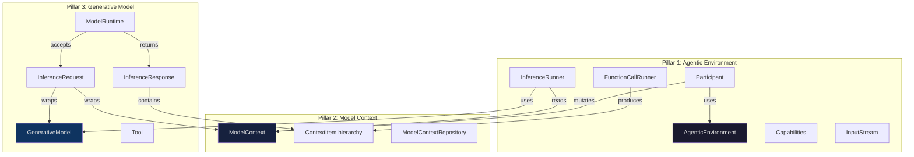
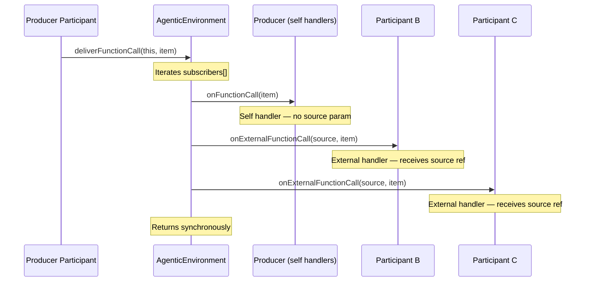
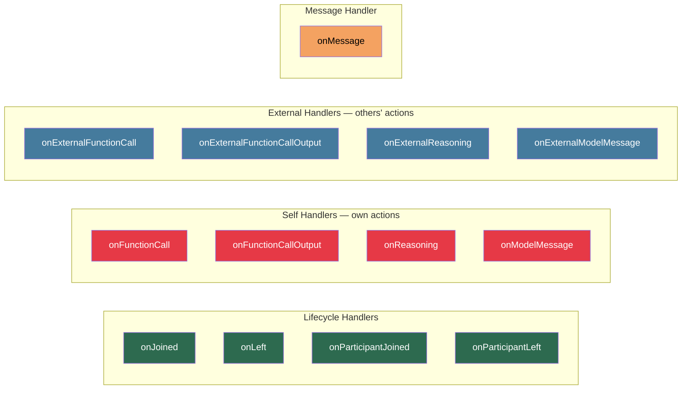
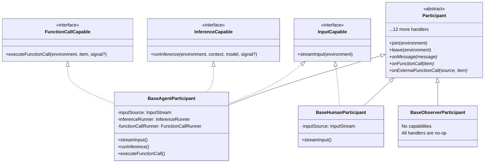
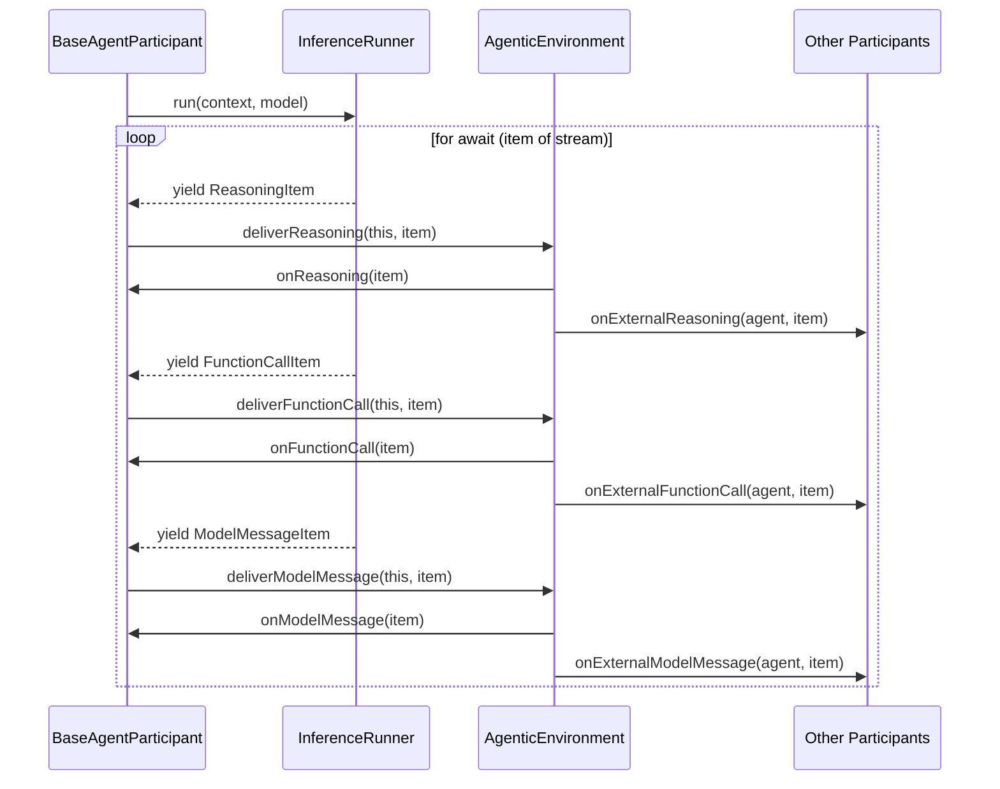
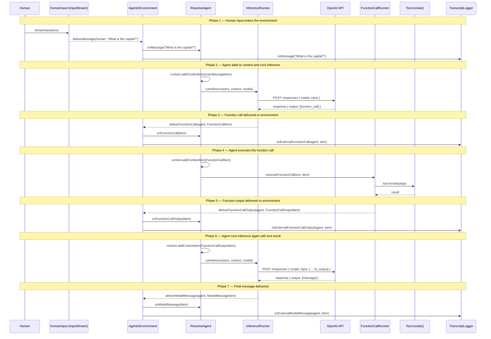
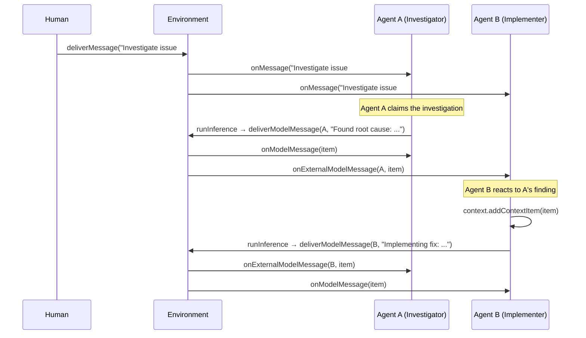

# Mozaik Framework — Complete Architecture Reference

**Purpose:** Comprehensive technical analysis of the [Mozaik](https://github.com/jigjoy-ai/mozaik) framework extracted from source code (v3.9.5, 782 LOC). This document serves as the canonical reference for the ://unblock Reactive Agent Environment RFC. Every pattern, interface, data flow, and design decision is documented so that mister-anderson can derive implementation specifications without gaps.

**Source:** `jigjoy-ai/mozaik` (main branch, cloned 2026-05-20) + `jigjoy-ai/mozaik-examples`

---

## 1. Architectural Overview

Mozaik is a TypeScript framework (~780 lines of production code) built on three architectural layers, following clean/hexagonal architecture conventions:

```
src/
├── domain/                         ← Pure domain logic, zero dependencies
│   ├── agentic-environment/        ← Core reactive system (5 files)
│   │   ├── agentic-environment.ts  ← Event bus + fan-out dispatcher
│   │   ├── participant.ts          ← Abstract base for all participants
│   │   ├── capabilities.ts         ← Capability interfaces
│   │   ├── inference-runner.ts     ← Async generator interface for LLM
│   │   ├── function-call-runner.ts ← Async generator interface for tools
│   │   └── input-stream.ts         ← Async generator interface for input
│   ├── model-context/              ← Context accumulation system (10 files)
│   │   ├── model-context.ts        ← Ordered list of ContextItems
│   │   ├── model-context-repository.ts ← Persistence interface
│   │   └── context-item/           ← Typed context item hierarchy
│   │       ├── context-item.ts     ← Abstract base
│   │       ├── client-item/        ← Items produced by clients
│   │       │   ├── user-message.ts
│   │       │   ├── developer-message.ts
│   │       │   ├── system-message.ts
│   │       │   └── function-call-output.ts
│   │       ├── model-item/         ← Items produced by LLM inference
│   │       │   ├── model-message.ts
│   │       │   ├── function-call.ts
│   │       │   └── reasoning.ts
│   │       └── item-content/       ← Content value objects
│   │           ├── item-content.ts
│   │           ├── input-text.ts
│   │           ├── output-text.ts
│   │           └── summary-text.ts
│   └── generative-model/          ← Model abstraction layer (8 files)
│       ├── generative-model.ts     ← Model interface + specification
│       ├── inference-request.ts    ← Request value object
│       ├── inference-response.ts   ← Response value object
│       ├── token-usage.ts          ← Token accounting
│       ├── token-delivery-mode.ts  ← Buffering vs streaming enum
│       ├── tool.ts                 ← Tool definition type
│       ├── capabilities/           ← Model capability interfaces
│       │   ├── reasoning-effort.ts
│       │   ├── streaming.ts
│       │   └── tool-calling.ts
│       └── runtime/                ← Runtime interfaces
│           ├── model-runtime.ts    ← Sync inference interface
│           └── streaming-runtime.ts ← Streaming inference interface
├── application/                    ← Concrete participants (4 files)
│   ├── agent.ts                    ← BaseAgentParticipant
│   ├── human.ts                    ← BaseHumanParticipant
│   ├── observer.ts                 ← BaseObserverParticipant
│   ├── openai-inference-runner.ts  ← OpenAI inference generator
│   └── function-call-runner.ts     ← Default tool executor generator
└── infrastructure/                 ← Provider implementations
    ├── providers/openai/
    │   ├── runtime/openai-responses.ts ← OpenAI Responses API runtime
    │   ├── models/                     ← Concrete model specs
    │   │   ├── gpt-5-4.ts
    │   │   ├── gpt-5-4-mini.ts
    │   │   ├── gpt-5-4-nano.ts
    │   │   └── gpt-5-5.ts
    │   ├── reasoning-effort.ts
    │   └── internal-tools.ts
    └── repository/
        └── in-memory-model-context-repository.ts
```

---

## 2. The Three Pillars

Mozaik is built on three orthogonal systems that compose but do not depend on each other circularly:



---

## 3. Pillar 1 — The Agentic Environment (complete)

### 3.1 AgenticEnvironment

The central event bus. All coordination flows through this single class.

**Source:** `src/domain/agentic-environment/agentic-environment.ts` (91 lines)

```typescript
class AgenticEnvironment {
    protected subscribers: Participant[] = []
    private isActive = false

    subscribe(subscriber: Participant): void    // Add participant, notify all
    unsubscribe(subscriber: Participant): void  // Remove participant, notify all
    
    // Event delivery methods — synchronous fan-out
    deliverFunctionCall(source: Participant, item: FunctionCallItem): void
    deliverModelMessage(source: Participant, item: ModelMessageItem): void
    deliverReasoning(source: Participant, item: ReasoningItem): void
    deliverFunctionCallOutput(source: Participant, item: FunctionCallOutputItem): void
    deliverMessage(source: Participant, message: string): void
    
    start(): Promise<void>  // Event loop (100ms poll)
    stop(): void
}
```

**Critical design decisions:**

1. **Synchronous fan-out.** Every `deliver*` method iterates `subscribers[]` synchronously. No queue, no buffer, no async dispatch. This means delivery is deterministic and ordered, but a slow subscriber blocks the producer temporarily.

2. **Self vs. External routing.** Each `deliver*` method compares `subscriber === source`. If same reference → calls the self handler (e.g., `onFunctionCall`). If different → calls the external handler (e.g., `onExternalFunctionCall`). This is the core of the reactive split.

3. **Message is special.** `deliverMessage` skips the source entirely (`if (subscriber === source) continue`). The message sender never receives its own message. All other event types deliver to both self and external.

4. **The event loop.** `start()` is a while-loop with `setTimeout(100)`. It keeps the Node.js process alive. No events are processed in this loop — it's purely a keepalive. All actual event processing happens synchronously inside the `deliver*` calls triggered by participants.

5. **No event types/enum.** Events are not represented as a discriminated union or typed enum. Each event type has its own dedicated `deliver*` method and corresponding handler pair. This is method-dispatch, not message-dispatch.

**Event delivery flow (detailed):**



### 3.2 Participant

Abstract base class for everything that lives in an environment.

**Source:** `src/domain/agentic-environment/participant.ts` (59 lines)

```typescript
abstract class Participant {
    private environments: AgenticEnvironment[] = []

    join(environment: AgenticEnvironment): void      // Idempotent
    leave(environment: AgenticEnvironment): void     // Idempotent
    protected isJoinedTo(environment: AgenticEnvironment): boolean
    getEnvironments(): AgenticEnvironment[]

    // Lifecycle handlers
    abstract onJoined(): Promise<void> | void
    abstract onLeft(): Promise<void> | void
    abstract onParticipantJoined(participant: Participant): Promise<void> | void
    abstract onParticipantLeft(participant: Participant): Promise<void> | void

    // Self handlers (triggered when THIS participant is the source)
    abstract onFunctionCall(item: FunctionCallItem): Promise<void> | void
    abstract onFunctionCallOutput(item: FunctionCallOutputItem): Promise<void> | void
    abstract onReasoning(item: ReasoningItem): Promise<void> | void
    abstract onModelMessage(item: ModelMessageItem): Promise<void> | void

    // External handlers (triggered when ANOTHER participant is the source)
    abstract onExternalFunctionCall(source: Participant, item: FunctionCallItem): Promise<void> | void
    abstract onExternalFunctionCallOutput(source: Participant, item: FunctionCallOutputItem): Promise<void> | void
    abstract onExternalReasoning(source: Participant, item: ReasoningItem): Promise<void> | void
    abstract onExternalModelMessage(source: Participant, item: ModelMessageItem): Promise<void> | void

    // Message handler (only receives messages from OTHER participants)
    abstract onMessage(message: string): Promise<void> | void
}
```

**Key observations:**

1. **Multi-environment.** A participant can join multiple environments simultaneously (`environments: AgenticEnvironment[]`). This enables cross-environment coordination.

2. **Idempotent join/leave.** `join()` checks `isJoinedTo()` before subscribing. No duplicate registrations.

3. **All handlers are abstract.** The base `Participant` forces implementors to define every handler. Concrete subclasses (`BaseAgentParticipant`, `BaseHumanParticipant`, `BaseObserverParticipant`) provide no-op defaults.

4. **Return type flexibility.** Every handler accepts `Promise<void> | void`. Handlers can be sync or async — the environment doesn't await them in the current implementation.

5. **13 handlers total.** 4 lifecycle + 4 self + 4 external + 1 message = 13 handler methods per participant.

### 3.3 The Complete Handler Taxonomy



**Handler routing rules:**

| Event produced by | `deliverFunctionCall` | `deliverFunctionCallOutput` | `deliverReasoning` | `deliverModelMessage` | `deliverMessage` |
|---|---|---|---|---|---|
| **Self (source === subscriber)** | `onFunctionCall(item)` | `onFunctionCallOutput(item)` | `onReasoning(item)` | `onModelMessage(item)` | *skipped* |
| **External (source !== subscriber)** | `onExternalFunctionCall(source, item)` | `onExternalFunctionCallOutput(source, item)` | `onExternalReasoning(source, item)` | `onExternalModelMessage(source, item)` | `onMessage(message)` |

Note: External handlers receive the `source: Participant` reference. Self handlers do not — the source is implicitly `this`.

### 3.4 Capabilities

Capabilities are interfaces that declare what a participant can actively do (not just react to).

**Source:** `src/domain/agentic-environment/capabilities.ts` (25 lines)

```typescript
interface InputCapable {
    streamInput(environment: AgenticEnvironment): Promise<void>
}

interface InferenceCapable {
    runInference(
        environment: AgenticEnvironment,
        context: ModelContext,
        model: GenerativeModel,
        signal?: AbortSignal,
    ): Promise<void>
}

interface FunctionCallCapable {
    executeFunctionCall(
        environment: AgenticEnvironment,
        functionCallItem: FunctionCallItem,
        signal?: AbortSignal,
    ): Promise<void>
}
```

**Capability composition per participant type:**



### 3.5 Generators (Async Iterables)

The three generator interfaces are the injection points for customising how input, inference, and tool execution work. All three produce events incrementally via `AsyncIterable`.

**InputStream** — produces plain text messages:
```typescript
interface InputStream {
    stream(signal?: AbortSignal): AsyncIterable<string>
}
```

**InferenceRunner** — produces typed model output items:
```typescript
interface InferenceRunner {
    run(
        context: ModelContext,
        model: GenerativeModel,
        signal?: AbortSignal,
    ): AsyncIterable<ReasoningItem | FunctionCallItem | ModelMessageItem>
}
```

**FunctionCallRunner** — produces function call outputs:
```typescript
interface FunctionCallRunner {
    run(
        functionCallItem: FunctionCallItem,
        signal?: AbortSignal,
    ): AsyncIterable<FunctionCallOutputItem>
}
```

**How generators connect to the environment:**



**The `runInference` implementation in BaseAgentParticipant (exact source):**

```typescript
async runInference(
    environment: AgenticEnvironment,
    context: ModelContext,
    model: GenerativeModel,
    signal?: AbortSignal,
): Promise<void> {
    if (!this.isJoinedTo(environment)) return  // Guard

    const stream = this.inferenceRunner.run(context, model, signal)

    for await (const item of stream) {
        if (item.type === "reasoning") {
            await environment.deliverReasoning(this, item)
        } else if (item.type === "function_call") {
            await environment.deliverFunctionCall(this, item)
        } else if (item.type === "message" && item.role === "assistant") {
            await environment.deliverModelMessage(this, item)
        }
    }
}
```

Key: it dispatches each yielded item to the correct `deliver*` method based on `item.type`. The `await` on `deliverReasoning` etc. means each item is fully delivered (all handlers called) before the next item is consumed from the generator.

### 3.6 The Three Concrete Participant Types

**BaseAgentParticipant** — Full agent with all three capabilities:
- Holds references to `InputStream`, `InferenceRunner`, `FunctionCallRunner` (injected via constructor)
- `streamInput()` → iterates `InputStream`, calls `deliverMessage` for each yielded string
- `runInference()` → iterates `InferenceRunner`, routes each item to correct `deliver*` method
- `executeFunctionCall()` → iterates `FunctionCallRunner`, calls `deliverFunctionCallOutput` for each result
- All 13 handlers default to no-op — subclasses override what they need

**BaseHumanParticipant** — Input only:
- Holds reference to `InputStream`
- `streamInput()` → iterates `InputStream`, calls `deliverMessage`
- All handlers default to no-op

**BaseObserverParticipant** — Passive observer:
- No capabilities
- No constructor dependencies
- All handlers default to no-op — subclasses override to observe

---

## 4. Pillar 2 — Model Context (complete)

### 4.1 ModelContext

An ordered, mutable list of `ContextItem`s that represents the conversation state for a single inference session.

**Source:** `src/domain/model-context/model-context.ts` (52 lines)

```typescript
class ModelContext {
    readonly id: string           // UUID
    readonly projectId: string    // Groups contexts per project
    readonly items: ContextItem[] // Ordered list

    addContextItem(item: ContextItem): ModelContext    // Append + return this (chainable)
    applyModelOutput(items: ContextItem[]): ModelContext  // Batch append (validates types)
    getItems(): ContextItem[]
    getLastItem(): ContextItem
    toJSON(): any[]

    static create(projectId: string): ModelContext     // Factory with random UUID
    static rehydrate(data: {...}): ModelContext         // Reconstruct from stored data
}
```

**Design notes:**
- Mutable despite `readonly` on fields — `items` array is mutated in place via `push()`.
- `applyModelOutput` validates that only model-produced types (`function_call`, `message`, `reasoning`) are added.
- `projectId` groups contexts — the `ModelContextRepository` can query all contexts for a project.

### 4.2 ContextItem Hierarchy

```mermaid
classDiagram
    class ContextItem {
        <<abstract>>
        +type: string
        +getType(): string
        +toJSON(): any
    }

    class ItemContent {
        <<abstract>>
        +type: string
    }

    class InputText {
        +type = "input_text"
        +text: string
        +static create(text): InputText
        +static rehydrate(data): InputText
    }

    class OutputText {
        +type = "output_text"
        +text: string
        +static rehydrate(data): OutputText
    }

    class SummaryText {
        +type = "summary_text"
        +text: string
        +static rehydrate(data): SummaryText
    }

    class UserMessageItem {
        +type = "message"
        +role = "user"
        +content: InputText
    }

    class DeveloperMessageItem {
        +type = "message"
        +role = "developer"
        +content: InputText
    }

    class SystemMessageItem {
        +type = "message"
        +role = "system"
        +content: InputText
    }

    class FunctionCallOutputItem {
        +type = "function_call_output"
        +callId: string
        +output: InputText
    }

    class FunctionCallItem {
        +type = "function_call"
        +callId: string
        +name: string
        +args: string
    }

    class ModelMessageItem {
        +type = "message"
        +role = "assistant"
        +content: OutputText
    }

    class ReasoningItem {
        +type = "reasoning"
        +content: InputText?
        +encryptedContent: string?
        +summary: SummaryText[]
    }

    ContextItem <|-- UserMessageItem
    ContextItem <|-- DeveloperMessageItem
    ContextItem <|-- SystemMessageItem
    ContextItem <|-- FunctionCallOutputItem
    ContextItem <|-- FunctionCallItem
    ContextItem <|-- ModelMessageItem
    ContextItem <|-- ReasoningItem
    ItemContent <|-- InputText
    ItemContent <|-- OutputText
    ItemContent <|-- SummaryText
```



**Item classification:**

| Item | `type` | `role` | Produced by | Consumed by |
|------|--------|--------|-------------|-------------|
| `UserMessageItem` | `message` | `user` | Client (human/agent input) | LLM inference |
| `DeveloperMessageItem` | `message` | `developer` | Client (system prompt) | LLM inference |
| `SystemMessageItem` | `message` | `system` | Client (legacy system prompt) | LLM inference |
| `FunctionCallOutputItem` | `function_call_output` | — | `FunctionCallRunner` | LLM inference (next turn) |
| `FunctionCallItem` | `function_call` | — | LLM inference | `FunctionCallRunner` |
| `ModelMessageItem` | `message` | `assistant` | LLM inference | Client display/logging |
| `ReasoningItem` | `reasoning` | — | LLM inference | Context accumulation |

**Serialisation format (JSON):**

Each item serialises via `toJSON()` to match the OpenAI Responses API wire format:

```json
// UserMessageItem
{ "type": "message", "role": "user", "content": [{"type": "input_text", "text": "..."}] }

// FunctionCallItem
{ "type": "function_call", "call_id": "...", "name": "...", "arguments": "..." }

// FunctionCallOutputItem
{ "type": "function_call_output", "call_id": "...", "output": [{"type": "input_text", "text": "..."}] }

// ModelMessageItem
{ "type": "message", "role": "assistant", "content": [{"type": "output_text", "text": "..."}] }

// ReasoningItem
{ "type": "reasoning", "content": [...], "encryptedContent": "...", "summary": [...] }
```

### 4.3 ModelContextRepository

Persistence interface for context storage:

```typescript
interface ModelContextRepository {
    save(context: ModelContext): Promise<void>
    get(id: string): Promise<ModelContext>
    getByProjectId(projectId: string): Promise<ModelContext[]>
}
```

The only bundled implementation is `InMemoryModelContextRepository` using `Map<string, ModelContext>` + a secondary `Map<string, Set<string>>` index for project-level queries. It clones contexts on save/get to prevent reference sharing.

---

## 5. Pillar 3 — Generative Model (complete)

### 5.1 GenerativeModel Interface

```typescript
type ModelSpecification = {
    name: string                      // Wire name (e.g., "gpt-5.4")
    supportReasoningEffort: boolean
    defaultReasoningEffort: string | undefined
    supportStreaming: boolean
    contextWindowSize: number         // Max input tokens
    maxOutputTokens: number
    supportFunctionCalling: boolean
}

interface GenerativeModel extends ReasoningEffort<string>, ToolCallingCapability {
    readonly specification: ModelSpecification
}
```

**Bundled models:**

| Class | Wire name | Context window | Max output | Reasoning | Tools |
|-------|-----------|----------------|------------|-----------|-------|
| `Gpt54` | `gpt-5.4` | 1,050,000 | 128,000 | ✓ | ✓ |
| `Gpt54Mini` | `gpt-5.4-mini` | 400,000 | 128,000 | ✓ | ✓ |
| `Gpt54Nano` | `gpt-5.4-nano` | 400,000 | 128,000 | ✓ | ✓ |
| `Gpt55` | `gpt-5.5` | 1,050,000 | 128,000 | ✓ | ✓ |

### 5.2 Tool Definition

```typescript
interface FunctionTool {
    type: "function"
    name: string
    description: string
    parameters: Record<string, any>  // JSON Schema
    strict: boolean
    invoke: (args: any) => Promise<any>  // Runtime execution function
}

type Tool = FunctionTool  // Only function tools supported currently
```

Tools carry both their schema (for LLM tool calling) and their implementation (`invoke`) in the same object.

### 5.3 ModelRuntime

```typescript
interface ModelRuntime {
    infer(request: InferenceRequest): Promise<InferenceResponse>
}

interface StreamingRuntime {
    stream(model: StreamingModel, context: ModelContext): AsyncIterable<ContextItem[]>
}
```

The bundled `OpenAIResponses` implements `ModelRuntime` (non-streaming). It uses the OpenAI SDK's `client.responses.create()` endpoint, maps `ModelContext` items to the wire format, and parses the response back into typed `ContextItem`s.

### 5.4 Token Accounting

```typescript
class TokenUsage {
    readonly inputTokens: number
    readonly outputTokens: number
    readonly totalTokens: number
    readonly inputTokenDetails: InputTokenDetails   // { cached_tokens }
    readonly outputTokenDetails: OutputTokenDetails // { reasoning_tokens }
}
```

Returned as part of `InferenceResponse`. Not used by any internal logic — purely informational.

---

## 6. Complete Data Flow — The Reactive Agent Loop

This diagram shows the complete flow from human input through inference, tool execution, and back to the human, with all participants involved:



---

## 7. Composition Patterns

### 7.1 Reactive Agent (from examples)

The canonical pattern for a working agent. Overrides only the handlers it needs:

```typescript
class ReactiveAgent extends BaseAgentParticipant {
    // Triggered when any other participant sends a message
    onMessage(message: string) {
        this.context.addContextItem(UserMessageItem.create(message))
        this.runInference(this.environment, this.context, this.model)
    }

    // Triggered when THIS agent's inference produces a function call
    onFunctionCall(item: FunctionCallItem) {
        this.context.addContextItem(item)
        this.executeFunctionCall(this.environment, item)
    }

    // Triggered when THIS agent's function call runner produces output
    onFunctionCallOutput(item: FunctionCallOutputItem) {
        this.context.addContextItem(item)
        this.runInference(this.environment, this.context, this.model)
    }
}
```

Pattern: message → add to context → infer → function call → add to context → execute → output → add to context → infer again → ... until the model produces a `ModelMessageItem` (final answer).

### 7.2 Parallel Function Calls (from terminal-agent example)

When the LLM emits multiple function calls in one inference turn:

```typescript
class TerminalAgent extends BaseAgentParticipant {
    private pendingCalls = new Set<string>()

    onFunctionCall(item: FunctionCallItem) {
        this.pendingCalls.add(item.callId)       // Track pending
        this.context.addContextItem(item)
        this.executeFunctionCall(this.environment, item)
    }

    onFunctionCallOutput(item: FunctionCallOutputItem) {
        this.context.addContextItem(item)
        this.pendingCalls.delete(item.callId)    // Mark complete
        if (this.pendingCalls.size === 0) {      // All done?
            this.runInference(this.environment, this.context, this.model)
        }
    }
}
```

This collects all function call outputs before re-running inference, preventing partial context.

### 7.3 Passive Observer (TranscriptLogger)

Extends `Participant` directly (not any Base* class). Overrides only external handlers:

```typescript
class TranscriptLogger extends Participant {
    onMessage(message: string) { console.log("[message]", message) }
    onExternalFunctionCall(source, item) { console.log(`[${source.constructor.name}] fc`, item.toJSON()) }
    onExternalFunctionCallOutput(source, item) { console.log(`[${source.constructor.name}] fco`, item.toJSON()) }
    onExternalReasoning(source, item) { console.log(`[${source.constructor.name}] reasoning`, item.toJSON()) }
    onExternalModelMessage(source, item) { console.log(`[${source.constructor.name}] msg`, item.toJSON()) }

    // Self handlers — no-op (logger never produces events)
    onFunctionCall() {}
    onFunctionCallOutput() {}
    onReasoning() {}
    onModelMessage() {}
}
```

### 7.4 Multi-Agent Collaboration Pattern

Not in examples but architecturally enabled. Two agents in the same environment where Agent B reacts to Agent A's outputs:



---

## 8. What Mozaik Does NOT Do

Understanding the gaps is as important as understanding the features for the ://unblock integration:

1. **No persistence.** The `AgenticEnvironment` is purely in-memory. When the process ends, all state is lost. The `ModelContextRepository` interface exists but only has an in-memory implementation.

2. **No authentication/authorisation.** Any participant can join any environment. No scoping, no API keys, no access control.

3. **No event persistence or replay.** Events are delivered synchronously and forgotten. Late joiners miss everything. No event log, no replay mechanism.

4. **No backpressure.** Synchronous fan-out means a slow subscriber blocks the producer. No buffer, no drop policy, no rate limiting.

5. **No participant identity.** Participants are identified by object reference (`===`), not by a unique ID. The `source` parameter in external handlers gives the raw Participant reference.

6. **No event filtering.** Every participant receives every event in its environment. No subscription filters, no topic-based routing.

7. **No error handling in delivery.** If a handler throws, it propagates up through the delivery loop. No try/catch, no error isolation between subscribers.

8. **No cross-environment communication.** A participant can join multiple environments, but there's no mechanism for environments to exchange events.

9. **No provider abstraction.** Despite the clean domain/infra split, the only bundled provider is OpenAI. No Anthropic, no generic HTTP provider.

10. **No streaming inference.** The `StreamingRuntime` interface exists but has no implementation. The `OpenAIResponses` runtime uses buffered (non-streaming) inference only.

---

## 9. Public API Surface

The `index.ts` exports exactly 27 symbols:

| Export | Layer | Category |
|--------|-------|----------|
| `AgenticEnvironment` | Domain | Environment |
| `Participant` | Domain | Participant |
| `BaseAgentParticipant` | Application | Participant |
| `BaseHumanParticipant` | Application | Participant |
| `BaseObserverParticipant` | Application | Participant |
| `InputStream` | Domain | Generator interface |
| `InferenceRunner` | Domain | Generator interface |
| `FunctionCallRunner` | Domain | Generator interface |
| `OpenAIInferenceRunner` | Application | Generator implementation |
| `DefaultFunctionCallRunner` | Application | Generator implementation |
| `ModelContext` | Domain | Context |
| `ModelContextRepository` | Domain | Context persistence |
| `InMemoryModelContextRepository` | Infrastructure | Context persistence |
| `ContextItem` | Domain | Context item base |
| `UserMessageItem` | Domain | Context item |
| `DeveloperMessageItem` | Domain | Context item |
| `SystemMessageItem` | Domain | Context item |
| `ModelMessageItem` | Domain | Context item |
| `FunctionCallItem` | Domain | Context item |
| `FunctionCallOutputItem` | Domain | Context item |
| `ReasoningItem` | Domain | Context item |
| `GenerativeModel` | Domain | Model |
| `OpenAIResponses` | Infrastructure | Model runtime |
| `InferenceRequest` | Domain | Model |
| `InferenceResponse` | Domain | Model |
| `TokenUsage` / `InputTokenDetails` / `OutputTokenDetails` | Domain | Telemetry |
| `Tool` | Domain | Tool definition |
| `Gpt54` / `Gpt54Mini` / `Gpt54Nano` / `Gpt55` | Infrastructure | Model specs |

---

## 10. Summary of Core Principles for ://unblock Integration

1. **The environment is the coordination primitive.** Not a queue, not a scheduler, not an orchestrator. It's a shared space where events flow and participants react. In ://unblock terms: the project is the environment.

2. **Self/External split enables decoupled composition.** Participants encode "what I do with my own outputs" separately from "how I react to others". This is the key to building multi-agent pipelines without central coordination.

3. **Generators produce events incrementally.** The `AsyncIterable` pattern means events are emitted as they're produced (each yield = one event delivered to all participants). This enables real-time reactivity.

4. **Handlers default to no-op.** Participants only implement what they care about. This keeps participant implementations small and focused.

5. **No awaiting in delivery.** The environment delivers events without awaiting handlers. Slow participants don't block fast ones (in practice — the current synchronous implementation has a nuance here, but the design intent is non-blocking).

6. **Context is explicit and mutable.** Each agent manages its own `ModelContext`. There is no shared context between agents. Communication happens through the event stream, not through shared state.

7. **Tools carry both schema and implementation.** A `Tool` is its JSON Schema definition (for the LLM) and its `invoke` function (for execution) in one object. This eliminates the schema/implementation sync problem.

8. **The framework has no opinions about what agents do.** It provides the reactive infrastructure — participants, events, generators. The agent's behaviour is entirely defined by which handlers it overrides and what it does inside them.
