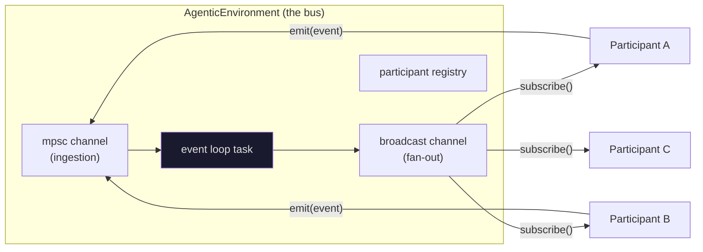
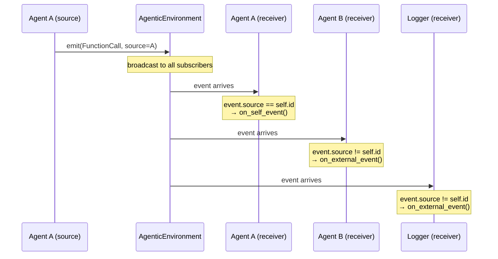
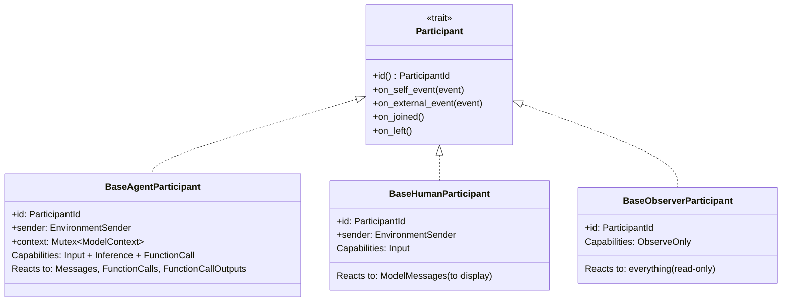
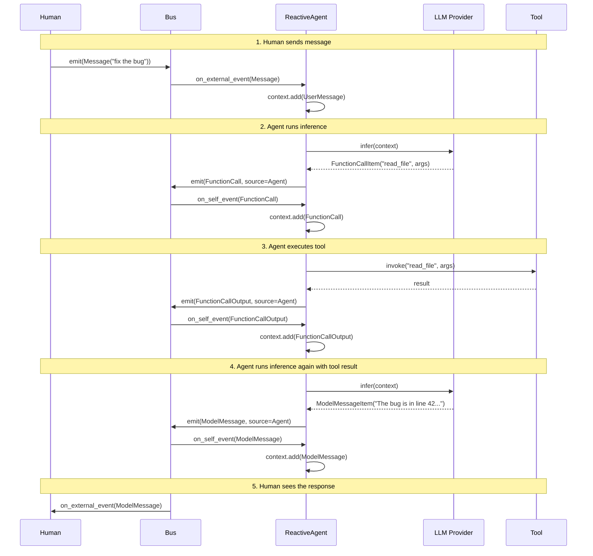
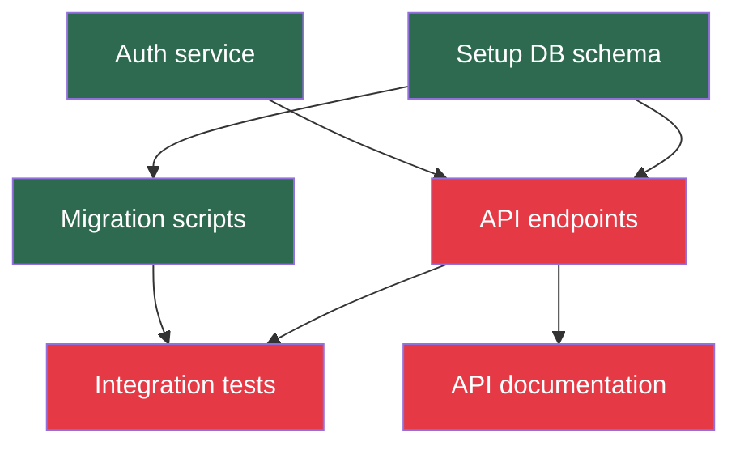
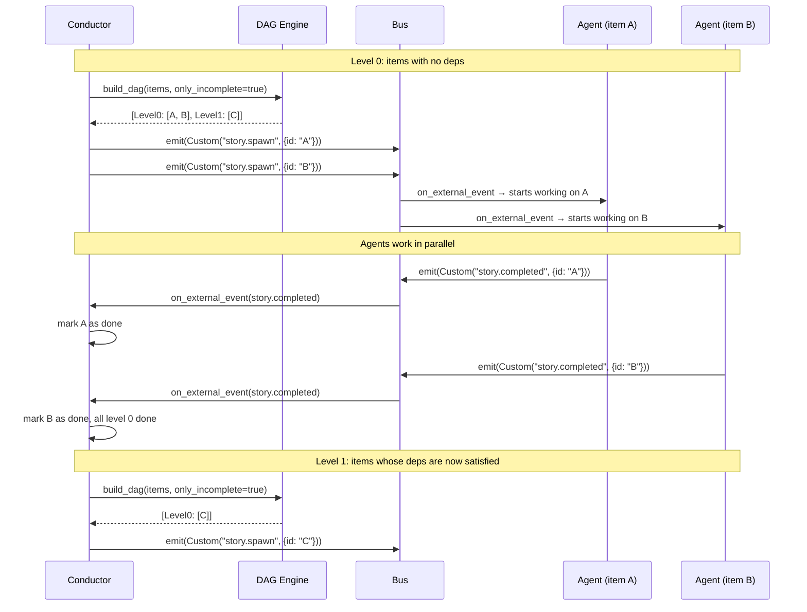

# unblock-agentic — Reactive Agent Framework in Rust

**Purpose:** Complete crate design translating the Mozaik reactive agent pattern to Rust, focused on the three essential primitives: the **Bus** (event delivery), the **Participants** (reactive actors), and the **DAG** (dependency-ordered task execution). This document is the implementation specification for the `unblock-agentic` crate within the ://unblock workspace.

**Derived from:** [MOZAIK-ARCHITECTURE-REFERENCE.md](MOZAIK-ARCHITECTURE-REFERENCE.md) (Mozaik v3.9.5) + [jigjoy-ai/baro](https://github.com/jigjoy-ai/baro) orchestrator source

**Crate location:** `crates/unblock-agentic/`
**Edition:** 2024

---

## 1. What This Crate Is

`unblock-agentic` is the Rust equivalent of Mozaik's `@mozaik-ai/core` — a reactive, event-driven framework where participants collaborate through a shared event bus without a central scheduler. Instead of one agent calling another, agents react to events in the environment.

Three concepts, nothing else:

- **Bus** — the shared event bus where events flow. Every participant publishes to it and subscribes from it. It's the spine.
- **Participants** — anything connected to the bus: AI agents, humans, observers, automated processes. Each reacts to events by overriding handlers.
- **DAG** — Directed Acyclic Graph: the dependency engine that computes which tasks can run in parallel and which must wait. It's how the bus knows what to unlock next.

---

## 2. Crate Structure

```
crates/unblock-agentic/
├── Cargo.toml
└── src/
    ├── lib.rs                      ← Public API
    ├── bus/
    │   ├── mod.rs
    │   ├── environment.rs          ← AgenticEnvironment
    │   ├── event.rs                ← EnvironmentEvent + EventPayload
    │   └── bus_event.rs            ← BusEvent trait (extensible custom events)
    ├── participant/
    │   ├── mod.rs
    │   ├── traits.rs               ← Participant trait + capabilities
    │   ├── id.rs                   ← ParticipantId
    │   ├── agent.rs                ← BaseAgentParticipant
    │   ├── human.rs                ← BaseHumanParticipant
    │   └── observer.rs             ← BaseObserverParticipant
    ├── context/
    │   ├── mod.rs
    │   ├── model_context.rs        ← ModelContext (ordered item list)
    │   └── context_item.rs         ← ContextItem enum
    └── dag/
        ├── mod.rs
        └── topological.rs          ← Kahn's algorithm + level computation
```

Dependencies (Cargo.toml):

```toml
[dependencies]
tokio = { version = "1", features = ["full"] }
ulid = "1"
chrono = { version = "0.4", features = ["serde"] }
serde = { version = "1", features = ["derive"] }
serde_json = "1"
async-trait = "0.1"
tracing = "0.1"
```

---

## 3. The Bus

The bus is the central nervous system. Every event flows through it. Every participant listens on it. There is no other communication path.

### 3.1 How It Works



The flow:

1. A participant calls `environment.emit(event)` — this sends the event into an `mpsc` (multi-producer, single-consumer) channel. Non-blocking: if the buffer is full, the event is dropped (backpressure by design).
2. A background Tokio task reads from the `mpsc` channel and forwards each event to a `broadcast` channel.
3. Every participant holds a `broadcast::Receiver`. Each one receives every event independently, in its own Tokio task, on potentially different CPU cores.
4. Each participant compares `event.source` with its own `ParticipantId` to decide: is this my own action (self) or someone else's (external)?

### 3.2 ParticipantId

In Mozaik, participants are identified by JavaScript object reference (`===`). In Rust, we need explicit identity:

```rust
#[derive(Clone, Copy, PartialEq, Eq, Hash, Debug)]
pub struct ParticipantId(ulid::Ulid);

impl ParticipantId {
    pub fn new() -> Self {
        Self(ulid::Ulid::new())
    }
}

impl std::fmt::Display for ParticipantId {
    fn fmt(&self, f: &mut std::fmt::Formatter<'_>) -> std::fmt::Result {
        write!(f, "{}", self.0)
    }
}
```

ULID gives time-ordered, globally unique, sortable IDs — consistent with ://unblock's existing key strategy.

### 3.3 EnvironmentEvent

Mozaik uses 5 separate `deliver*` methods, one per event type. Rust uses a single enum — the compiler guarantees every match is exhaustive:

```rust
use chrono::{DateTime, Utc};
use serde::{Serialize, Deserialize};

/// Every event flowing through the bus.
#[derive(Clone, Debug)]
pub struct EnvironmentEvent {
    /// Who produced this event
    pub source: ParticipantId,
    /// When it happened
    pub timestamp: DateTime<Utc>,
    /// What happened
    pub payload: EventPayload,
}

/// The typed payload of an event.
#[derive(Clone, Debug)]
pub enum EventPayload {
    // ── Lifecycle ──
    ParticipantJoined {
        participant: ParticipantId,
        capabilities: Vec<Capability>,
        metadata: serde_json::Value,
    },
    ParticipantLeft {
        participant: ParticipantId,
        reason: String,
    },

    // ── Plain text message (like Mozaik's deliverMessage) ──
    Message(String),

    // ── LLM inference items (like Mozaik's typed delivery channels) ──
    FunctionCall(FunctionCallItem),
    FunctionCallOutput(FunctionCallOutputItem),
    Reasoning(ReasoningItem),
    ModelMessage(ModelMessageItem),

    // ── Extensible custom events (like baro's BusEvent) ──
    Custom(CustomEvent),
}

#[derive(Clone, Debug, PartialEq, Eq)]
pub enum Capability {
    Input,
    Inference,
    FunctionCall,
    ObserveOnly,
}
```

### 3.4 Custom Events (the BusEvent Extension)

Baro taught us that Mozaik's built-in event types aren't enough. Real orchestration needs domain-specific events (story spawned, level completed, replan requested). Baro solved this by extending the environment with a `deliverBusEvent` method. We solve it with the `Custom` variant:

```rust
/// A domain-specific event. Implementors define their own event types
/// and the bus carries them opaquely alongside the built-in types.
#[derive(Clone, Debug)]
pub struct CustomEvent {
    /// Discriminator string (e.g., "workitem.state_changed", "story.spawned")
    pub event_type: String,
    /// Arbitrary structured payload
    pub data: serde_json::Value,
}

impl CustomEvent {
    pub fn new(event_type: impl Into<String>, data: serde_json::Value) -> Self {
        Self {
            event_type: event_type.into(),
            data,
        }
    }
}
```

In ://unblock, the custom events would be things like:

```rust
// Examples of CustomEvent usage in ://unblock:
CustomEvent::new("workitem.state_changed", json!({
    "item_id": "wi_01JXY...",
    "old_state": "open",
    "new_state": "claimed",
}))

CustomEvent::new("deps.cascade", json!({
    "trigger_item_id": "wi_01JXY...",
    "newly_ready": ["wi_01JXZ...", "wi_01JXW..."],
}))

CustomEvent::new("pipeline.gate_passed", json!({
    "item_id": "wi_01JXY...",
    "gate": "investigate",
}))
```

### 3.5 AgenticEnvironment (complete implementation)

```rust
use tokio::sync::{broadcast, mpsc, RwLock};
use std::collections::HashMap;
use std::sync::Arc;

/// The shared event bus. One per project/workspace.
pub struct AgenticEnvironment {
    id: String,
    event_tx: mpsc::Sender<EnvironmentEvent>,
    broadcast_tx: broadcast::Sender<EnvironmentEvent>,
    registry: Arc<RwLock<HashMap<ParticipantId, ParticipantEntry>>>,
}

struct ParticipantEntry {
    id: ParticipantId,
    capabilities: Vec<Capability>,
    metadata: serde_json::Value,
}

impl AgenticEnvironment {
    /// Create a new environment.
    /// `buffer_size` controls backpressure — events beyond this are dropped.
    pub fn new(id: impl Into<String>, buffer_size: usize) -> Self {
        let (event_tx, event_rx) = mpsc::channel::<EnvironmentEvent>(buffer_size);
        let (broadcast_tx, _) = broadcast::channel::<EnvironmentEvent>(buffer_size);
        let registry = Arc::new(RwLock::new(HashMap::new()));

        // Spawn the event loop
        let btx = broadcast_tx.clone();
        tokio::spawn(async move {
            let mut rx = event_rx;
            while let Some(event) = rx.recv().await {
                let _ = btx.send(event);
            }
        });

        Self {
            id: id.into(),
            event_tx,
            broadcast_tx,
            registry,
        }
    }

    /// A participant joins the environment.
    /// Returns a Receiver it will use to listen for events.
    pub async fn join(
        &self,
        id: ParticipantId,
        capabilities: Vec<Capability>,
        metadata: serde_json::Value,
    ) -> broadcast::Receiver<EnvironmentEvent> {
        // Register
        self.registry.write().await.insert(id, ParticipantEntry {
            id,
            capabilities: capabilities.clone(),
            metadata: metadata.clone(),
        });

        // Broadcast the join event
        self.emit(EnvironmentEvent {
            source: id,
            timestamp: Utc::now(),
            payload: EventPayload::ParticipantJoined {
                participant: id,
                capabilities,
                metadata,
            },
        });

        self.broadcast_tx.subscribe()
    }

    /// A participant leaves the environment.
    pub async fn leave(&self, id: ParticipantId, reason: impl Into<String>) {
        self.registry.write().await.remove(&id);
        self.emit(EnvironmentEvent {
            source: id,
            timestamp: Utc::now(),
            payload: EventPayload::ParticipantLeft {
                participant: id,
                reason: reason.into(),
            },
        });
    }

    /// Submit an event to the bus. Non-blocking.
    /// If the buffer is full, the event is dropped (backpressure).
    pub fn emit(&self, event: EnvironmentEvent) {
        let _ = self.event_tx.try_send(event);
    }

    /// Get a cloneable sender handle that participants can hold.
    pub fn sender(&self) -> EnvironmentSender {
        EnvironmentSender {
            tx: self.event_tx.clone(),
        }
    }

    /// Query who is currently connected.
    pub async fn active_participants(&self) -> Vec<ParticipantId> {
        self.registry.read().await.keys().copied().collect()
    }

    pub fn id(&self) -> &str {
        &self.id
    }
}

/// A lightweight, cloneable handle for emitting events.
/// Participants hold this instead of a reference to the full environment.
#[derive(Clone)]
pub struct EnvironmentSender {
    tx: mpsc::Sender<EnvironmentEvent>,
}

impl EnvironmentSender {
    pub fn emit(&self, event: EnvironmentEvent) {
        let _ = self.tx.try_send(event);
    }
}
```

**Comparison with Mozaik:**

| Concern | Mozaik | unblock-agentic |
|---|---|---|
| Fan-out mechanism | Sync `for` loop over `subscribers[]` | Tokio `broadcast` channel |
| Concurrency | Single-threaded (Node event loop) | Multi-threaded (Tokio work-stealing) |
| Backpressure | None (slow subscriber blocks producer) | Buffer + drop (configurable size) |
| Event types | 5 separate `deliver*` methods | Single `EventPayload` enum |
| Self/External routing | Inside each `deliver*` method | Each participant checks `event.source == self.id` |
| Custom events | Not supported (baro patched it in) | Built-in `Custom(CustomEvent)` variant |
| Participant identity | Object reference (`===`) | `ParticipantId` (ULID) |
| Error isolation | None (throw propagates) | Each participant runs in its own Tokio task |

---

## 4. Participants

A participant is anything that connects to the bus, receives events, and optionally produces events. The pattern is: join the environment, get a receiver, loop over events, decide what to do.

### 4.1 The Participant Trait

```rust
use async_trait::async_trait;

/// Core trait for anything that lives in an AgenticEnvironment.
#[async_trait]
pub trait Participant: Send + Sync + 'static {
    /// This participant's unique identity.
    fn id(&self) -> ParticipantId;

    /// Called when this participant receives an event it produced itself.
    /// Default: no-op.
    async fn on_self_event(&self, _event: &EnvironmentEvent) {}

    /// Called when this participant receives an event produced by someone else.
    /// Default: no-op.
    async fn on_external_event(&self, _event: &EnvironmentEvent) {}

    /// Called once when this participant joins an environment.
    /// Default: no-op.
    async fn on_joined(&self) {}

    /// Called once when this participant leaves an environment.
    /// Default: no-op.
    async fn on_left(&self) {}
}
```

**Why two handlers instead of Mozaik's 13?**

Mozaik defines separate handler methods for each event type × self/external (e.g., `onFunctionCall`, `onExternalFunctionCall`, `onReasoning`, `onExternalReasoning`, etc. — 13 total). This works in TypeScript where method override is cheap. In Rust, a trait with 13 methods is unwieldy and most implementations only care about 2-3 events.

Instead, each participant gets two handlers: `on_self_event` (my own actions) and `on_external_event` (others' actions). Inside each, the participant pattern-matches on `event.payload` for the specific events it cares about. The compiler ensures exhaustiveness if they use `match`, and `_` catches everything else.

This achieves the same self/external split as Mozaik but with a cleaner trait surface:

```rust
// Mozaik: 13 methods, each a separate handler
class ReactiveAgent extends BaseAgentParticipant {
    onMessage(message: string) { ... }
    onFunctionCall(item: FunctionCallItem) { ... }
    onFunctionCallOutput(item: FunctionCallOutputItem) { ... }
    // ... 10 more
}

// unblock-agentic: 2 methods, pattern match inside
struct ReactiveAgent { ... }

#[async_trait]
impl Participant for ReactiveAgent {
    async fn on_external_event(&self, event: &EnvironmentEvent) {
        match &event.payload {
            EventPayload::Message(text) => { /* handle message */ }
            _ => {} // ignore everything else
        }
    }

    async fn on_self_event(&self, event: &EnvironmentEvent) {
        match &event.payload {
            EventPayload::FunctionCall(item) => { /* execute the tool */ }
            EventPayload::FunctionCallOutput(item) => { /* re-run inference */ }
            _ => {}
        }
    }
}
```

### 4.2 The Self/External Split (detailed)

This is the most important pattern in the framework. A single event on the bus reaches every participant, but each participant sees it differently depending on whether it produced the event:



Each participant runs a receive loop in its own Tokio task:

```rust
/// Spawn a participant's event loop on the Tokio runtime.
pub fn spawn_participant(
    participant: Arc<dyn Participant>,
    mut rx: broadcast::Receiver<EnvironmentEvent>,
) -> tokio::task::JoinHandle<()> {
    let id = participant.id();
    tokio::spawn(async move {
        participant.on_joined().await;

        loop {
            match rx.recv().await {
                Ok(event) => {
                    if event.source == id {
                        participant.on_self_event(&event).await;
                    } else {
                        participant.on_external_event(&event).await;
                    }
                }
                Err(broadcast::error::RecvError::Lagged(n)) => {
                    tracing::warn!(
                        participant = %id,
                        skipped = n,
                        "participant lagged, events dropped"
                    );
                }
                Err(broadcast::error::RecvError::Closed) => break,
            }
        }

        participant.on_left().await;
    })
}
```

**Key properties:**

- Each participant runs independently — a slow participant never blocks the bus or other participants (unlike Mozaik's synchronous fan-out).
- If a participant can't keep up, Tokio's broadcast channel drops old events and reports `Lagged(n)`. The participant can resync from the database.
- Panics in one participant don't crash others — each Tokio task has its own panic boundary.

### 4.3 Concrete Participant Types

Like Mozaik, we provide three ready-to-use base implementations:



**BaseAgentParticipant** — the reactive agent:

```rust
pub struct BaseAgentParticipant {
    id: ParticipantId,
    sender: EnvironmentSender,
    context: tokio::sync::Mutex<ModelContext>,
}

#[async_trait]
impl Participant for BaseAgentParticipant {
    fn id(&self) -> ParticipantId { self.id }

    async fn on_external_event(&self, event: &EnvironmentEvent) {
        match &event.payload {
            EventPayload::Message(text) => {
                // Another participant sent a message → add to context, run inference
                let mut ctx = self.context.lock().await;
                ctx.add_item(ContextItem::UserMessage(text.clone()));
                drop(ctx);
                self.run_inference().await;
            }
            _ => {}
        }
    }

    async fn on_self_event(&self, event: &EnvironmentEvent) {
        match &event.payload {
            EventPayload::FunctionCall(item) => {
                // My inference produced a function call → add to context, execute tool
                let mut ctx = self.context.lock().await;
                ctx.add_item(ContextItem::FunctionCall(item.clone()));
                drop(ctx);
                self.execute_function_call(item).await;
            }
            EventPayload::FunctionCallOutput(item) => {
                // My tool execution produced output → add to context, infer again
                let mut ctx = self.context.lock().await;
                ctx.add_item(ContextItem::FunctionCallOutput(item.clone()));
                drop(ctx);
                self.run_inference().await;
            }
            EventPayload::Reasoning(item) => {
                let mut ctx = self.context.lock().await;
                ctx.add_item(ContextItem::Reasoning(item.clone()));
            }
            EventPayload::ModelMessage(item) => {
                let mut ctx = self.context.lock().await;
                ctx.add_item(ContextItem::ModelMessage(item.clone()));
            }
            _ => {}
        }
    }
}
```

**BaseObserverParticipant** — passive watcher (audit log, metrics, UI stream):

```rust
pub struct BaseObserverParticipant {
    id: ParticipantId,
    handler: Box<dyn Fn(&EnvironmentEvent) + Send + Sync>,
}

#[async_trait]
impl Participant for BaseObserverParticipant {
    fn id(&self) -> ParticipantId { self.id }

    async fn on_external_event(&self, event: &EnvironmentEvent) {
        (self.handler)(event);
    }
    // on_self_event: default no-op (observers never produce events)
}
```

### 4.4 The Reactive Agent Loop (complete flow)

This is the core pattern — how a message from a human becomes a function call, then a tool execution, then a final response, all flowing through the bus:



---

## 5. Context Items

The ordered list of items that an LLM reasons over. Each agent manages its own context independently — there is no shared context between agents (communication happens through the bus, not through shared state).

```rust
/// A single item in a model's conversation context.
#[derive(Clone, Debug, Serialize, Deserialize)]
pub enum ContextItem {
    // Client-produced items
    UserMessage(String),
    DeveloperMessage(String),
    SystemMessage(String),
    FunctionCallOutput(FunctionCallOutputItem),

    // Model-produced items
    FunctionCall(FunctionCallItem),
    ModelMessage(ModelMessageItem),
    Reasoning(ReasoningItem),
}

#[derive(Clone, Debug, Serialize, Deserialize)]
pub struct FunctionCallItem {
    pub call_id: String,
    pub name: String,
    pub args: String, // JSON string
}

#[derive(Clone, Debug, Serialize, Deserialize)]
pub struct FunctionCallOutputItem {
    pub call_id: String,
    pub output: String,
}

#[derive(Clone, Debug, Serialize, Deserialize)]
pub struct ModelMessageItem {
    pub text: String,
}

#[derive(Clone, Debug, Serialize, Deserialize)]
pub struct ReasoningItem {
    pub content: Option<String>,
    pub summary: Vec<String>,
}

/// Ordered context for a single inference session.
pub struct ModelContext {
    pub id: String,
    pub project_id: String,
    items: Vec<ContextItem>,
}

impl ModelContext {
    pub fn new(project_id: impl Into<String>) -> Self {
        Self {
            id: ulid::Ulid::new().to_string(),
            project_id: project_id.into(),
            items: Vec::new(),
        }
    }

    pub fn add_item(&mut self, item: ContextItem) {
        self.items.push(item);
    }

    pub fn items(&self) -> &[ContextItem] {
        &self.items
    }

    pub fn last_item(&self) -> Option<&ContextItem> {
        self.items.last()
    }
}
```

---

## 6. The DAG — Directed Acyclic Graph

### 6.1 What Is a DAG and Why It Matters

A DAG (Directed Acyclic Graph) is a graph of nodes connected by directed edges, with no cycles. In ://unblock's context:

- **Nodes** are work items (tasks, stories, issues).
- **Edges** are dependencies: "item B depends on item A" means A must finish before B can start.
- **Acyclic** means no circular dependencies: A→B→C→A is forbidden.

The DAG answers one question: **what can I work on right now?**



In this graph:
- **Level 0** (no dependencies, can start immediately): `Setup DB schema`, `Auth service`
- **Level 1** (depends on level 0): `API endpoints`, `Migration scripts`
- **Level 2** (depends on level 1): `Integration tests`, `API documentation`

Items within the same level have no dependencies on each other — they can run **in parallel**. This is exactly what allows multiple agents to work simultaneously: the DAG tells us which items are independent.

### 6.2 Topological Sort (Kahn's Algorithm)

The algorithm that computes levels from a dependency graph. It's the same algorithm baro uses, translated to Rust:

```rust
use std::collections::{HashMap, HashSet};

/// A node in the dependency graph.
pub trait DagNode {
    fn id(&self) -> &str;
    fn depends_on(&self) -> &[String];
    fn is_completed(&self) -> bool;
    fn priority(&self) -> i32 { 0 }
}

/// A level: a set of nodes that can execute in parallel.
#[derive(Debug, Clone)]
pub struct DagLevel {
    pub node_ids: Vec<String>,
}

/// Options for building the DAG.
#[derive(Default)]
pub struct BuildOptions {
    /// If true, already-completed nodes are excluded and their deps treated as satisfied.
    pub only_incomplete: bool,
}

/// Compute execution levels from a set of nodes with dependencies.
/// Returns levels in order: level 0 first (no deps), then level 1, etc.
///
/// # Errors
/// Returns an error if a dependency cycle is detected.
pub fn build_dag(
    nodes: &[impl DagNode],
    options: BuildOptions,
) -> Result<Vec<DagLevel>, DagError> {
    let completed: HashSet<&str> = nodes
        .iter()
        .filter(|n| n.is_completed())
        .map(|n| n.id())
        .collect();

    // Filter to active nodes
    let active: Vec<&dyn DagNode> = if options.only_incomplete {
        nodes.iter()
            .filter(|n| !n.is_completed())
            .map(|n| n as &dyn DagNode)
            .collect()
    } else {
        nodes.iter().map(|n| n as &dyn DagNode).collect()
    };

    let node_set: HashSet<&str> = active.iter().map(|n| n.id()).collect();

    // Compute in-degree for each node
    let mut in_degree: HashMap<&str, usize> = HashMap::new();
    let mut dependents: HashMap<&str, Vec<&str>> = HashMap::new();

    for node in &active {
        let active_deps: Vec<&str> = node.depends_on()
            .iter()
            .map(|d| d.as_str())
            .filter(|d| node_set.contains(d))
            .filter(|d| !options.only_incomplete || !completed.contains(d))
            .collect();

        in_degree.insert(node.id(), active_deps.len());

        for dep in active_deps {
            dependents.entry(dep).or_default().push(node.id());
        }
    }

    // Kahn's algorithm: peel off nodes with in-degree 0 level by level
    let mut levels: Vec<DagLevel> = Vec::new();
    let mut queue: Vec<&dyn DagNode> = active.iter()
        .filter(|n| *in_degree.get(n.id()).unwrap_or(&0) == 0)
        .copied()
        .collect();

    while !queue.is_empty() {
        // Sort by priority within each level
        queue.sort_by_key(|n| n.priority());

        let level = DagLevel {
            node_ids: queue.iter().map(|n| n.id().to_string()).collect(),
        };
        levels.push(level);

        let mut next_queue: Vec<&dyn DagNode> = Vec::new();
        for node in &queue {
            if let Some(deps) = dependents.get(node.id()) {
                for dep_id in deps {
                    if let Some(deg) = in_degree.get_mut(dep_id) {
                        *deg = deg.saturating_sub(1);
                        if *deg == 0 {
                            if let Some(dep_node) = active.iter().find(|n| n.id() == *dep_id) {
                                next_queue.push(*dep_node);
                            }
                        }
                    }
                }
            }
        }

        queue = next_queue;
    }

    // Cycle detection: if not all nodes were placed, there's a cycle
    let placed: HashSet<&str> = levels.iter()
        .flat_map(|l| l.node_ids.iter().map(|s| s.as_str()))
        .collect();

    if placed.len() != active.len() {
        let cycled: Vec<String> = active.iter()
            .filter(|n| !placed.contains(n.id()))
            .map(|n| n.id().to_string())
            .collect();
        return Err(DagError::CycleDetected(cycled));
    }

    Ok(levels)
}

#[derive(Debug, thiserror::Error)]
pub enum DagError {
    #[error("dependency cycle detected: {0:?}")]
    CycleDetected(Vec<String>),
}
```

### 6.3 DAG + Bus + Participants: How They Compose

The DAG computes what's ready. The bus delivers events. Participants react. Together they form a self-driving execution engine:



The Conductor is itself a participant. It doesn't call agents directly — it emits events on the bus, and agents react. The DAG is a pure function that the Conductor calls to decide what to emit next.

### 6.4 Why This Matters for ://unblock

The DAG engine maps directly to ://unblock's dependency graph. Today, `deps.recomputed` is a Pub/Sub topic that fires when dependencies change. The DAG module formalises what that computation looks like:

```rust
// ://unblock work items implement DagNode
impl DagNode for WorkItem {
    fn id(&self) -> &str { &self.id }
    fn depends_on(&self) -> &[String] { &self.blocking_items }
    fn is_completed(&self) -> bool { self.state == "done" }
    fn priority(&self) -> i32 { self.priority }
}

// When an agent closes a work item, the Conductor:
// 1. Marks it done
// 2. Rebuilds the DAG
// 3. Emits spawn events for newly-ready items
// 4. Other agents react and start working
```

This is the `ready → claim → cascade` loop from the PRD, but driven by reactive events instead of polling.

---

## 7. Composition Examples

### 7.1 Audit Logger (Observer)

```rust
struct AuditLogger {
    id: ParticipantId,
    writer: tokio::sync::Mutex<BufWriter<File>>,
}

#[async_trait]
impl Participant for AuditLogger {
    fn id(&self) -> ParticipantId { self.id }

    async fn on_external_event(&self, event: &EnvironmentEvent) {
        let json = serde_json::to_string(event).unwrap_or_default();
        let mut w = self.writer.lock().await;
        let _ = writeln!(w, "{}", json);
    }
}
```

### 7.2 Quality Gate (Observer that can emit)

```rust
struct QualityGate {
    id: ParticipantId,
    sender: EnvironmentSender,
}

#[async_trait]
impl Participant for QualityGate {
    fn id(&self) -> ParticipantId { self.id }

    async fn on_external_event(&self, event: &EnvironmentEvent) {
        if let EventPayload::Custom(ce) = &event.payload {
            if ce.event_type == "workitem.state_changed" {
                let new_state = ce.data["new_state"].as_str().unwrap_or("");
                let item_id = ce.data["item_id"].as_str().unwrap_or("");

                if new_state == "review" {
                    // Check: does an INVESTIGATION comment exist?
                    let has_investigation = self.check_investigation(item_id).await;
                    if !has_investigation {
                        // Block the transition
                        self.sender.emit(EnvironmentEvent {
                            source: self.id,
                            timestamp: Utc::now(),
                            payload: EventPayload::Custom(CustomEvent::new(
                                "pipeline.gate_blocked",
                                json!({
                                    "item_id": item_id,
                                    "gate": "investigate",
                                    "reason": "No INVESTIGATION comment found",
                                }),
                            )),
                        });
                    }
                }
            }
        }
    }
}
```

### 7.3 Multi-Agent Pipeline (Personas as Participants)

The mister-anderson pattern — each persona is an independent participant:

```rust
struct InvestigatorAgent {
    id: ParticipantId,
    sender: EnvironmentSender,
    context: Mutex<ModelContext>,
}

#[async_trait]
impl Participant for InvestigatorAgent {
    fn id(&self) -> ParticipantId { self.id }

    async fn on_external_event(&self, event: &EnvironmentEvent) {
        if let EventPayload::Custom(ce) = &event.payload {
            // React when a work item needs investigation
            if ce.event_type == "workitem.claimed" {
                let stage = ce.data["stage"].as_str().unwrap_or("");
                if stage == "investigate" {
                    let item_id = ce.data["item_id"].as_str().unwrap_or("");
                    self.investigate(item_id).await;
                    // Post investigation comment and transition state
                    self.sender.emit(EnvironmentEvent {
                        source: self.id,
                        timestamp: Utc::now(),
                        payload: EventPayload::Custom(CustomEvent::new(
                            "workitem.state_changed",
                            json!({
                                "item_id": item_id,
                                "old_state": "investigating",
                                "new_state": "investigated",
                            }),
                        )),
                    });
                }
            }
        }
    }
}

struct ImplementerAgent {
    id: ParticipantId,
    sender: EnvironmentSender,
    context: Mutex<ModelContext>,
}

#[async_trait]
impl Participant for ImplementerAgent {
    fn id(&self) -> ParticipantId { self.id }

    async fn on_external_event(&self, event: &EnvironmentEvent) {
        if let EventPayload::Custom(ce) = &event.payload {
            // React when investigation is done → start implementing
            if ce.event_type == "pipeline.gate_passed" {
                let gate = ce.data["gate"].as_str().unwrap_or("");
                if gate == "investigate" {
                    let item_id = ce.data["item_id"].as_str().unwrap_or("");
                    self.implement(item_id).await;
                }
            }
        }
    }
}
```

The pipeline emerges from reactions: Investigator finishes → emits state change → Quality Gate passes → emits gate_passed → Implementer reacts. No scheduler. No coupling between personas.

---

## 8. What Mozaik Does That We Keep vs. Change

| Concept | Mozaik | unblock-agentic | Rationale |
|---|---|---|---|
| Event bus | Synchronous array loop | Tokio broadcast channel | Real parallelism, backpressure |
| Self/External split | 13 handler methods | 2 methods + pattern match | Cleaner trait, same semantics |
| Custom events | Not supported (baro patched) | Built-in `Custom` variant | First-class from day one |
| Participant identity | Object reference | ULID-based `ParticipantId` | Serialisable, networkable |
| Error isolation | None | Tokio task boundaries | One participant crash ≠ system crash |
| Context management | Mutable, per-agent | `Mutex<ModelContext>`, per-agent | Same pattern, thread-safe |
| DAG | Not in Mozaik (baro added) | Built-in module | Core to ://unblock's dependency graph |
| Async generators | `AsyncIterable<T>` | `Stream<Item=T>` (futures) | Rust equivalent |
| AI model | OpenAI runtime bundled | Not in the crate | The AI model lives inside Claude Code sessions; the crate orchestrates those sessions, it doesn't call LLMs |

## 9. What We Intentionally Exclude

- **LLM / AI model abstraction** — the crate does not call LLMs. Claude Code sessions have their own models internally. The crate spawns and orchestrates those sessions; it does not reason.
- **TUI** — not part of this crate. Visualisation is the Astro web client (remote, team-visible).
- **HTTP/SSE client** — the MCP bridge (connecting to the ://unblock backend) is a separate concern. The crate provides the local bus; wiring it to the backend is the daemon binary's job.
- **Persistence** — the crate is in-memory. The ://unblock Postgres layer handles persistence.
- **baro-specific orchestration** — no Critic, Surgeon, Librarian as built-in participants. The crate provides the primitives (bus, participants, DAG). Domain-specific participants are built by the consumer.

---

## 10. The Daemon — How It All Runs

The `unblock-agentic` crate is a library. The daemon binary (`unblock-agentic` CLI) consumes it and adds:

- Config parsing (`~/.unblock/config.toml`)
- MCP client (connects to the ://unblock backend per project)
- SSE listener (receives backend events, feeds them into the local bus)
- Claude Code subprocess management (spawns sessions in the project's `cwd`)
- Unix socket server (for CLI commands like `status`, `pause`, `logs`)

**Per-project config (each project is fully independent):**

```toml
[[projects]]
name = "unblock-v1"
org = "websublime"
api_key = "ub_key_abc..."
endpoint = "https://api.unblock.websublime.com"
cwd = "/home/miguel/code/unblock"
max_parallel = 3
auto_run = true
```

**Daemon lifecycle:**

```bash
unblock-agentic daemon start          # background process, manages all projects
unblock-agentic daemon stop
unblock-agentic daemon status

unblock-agentic status                # summary across projects
unblock-agentic status unblock-v1     # detail for one project
unblock-agentic run unblock-v1        # manual trigger
unblock-agentic pause unblock-v1
unblock-agentic logs unblock-v1 -f

unblock-agentic project add           # interactive setup
unblock-agentic project remove name
```

**The two-layer flow:**

```
Local (daemon)                              Remote (://unblock backend)

Bus receives "start" command
  │
  ├─► Conductor calls ready() ──── MCP ────► backend returns items A, B, C
  │
  ├─► Conductor computes DAG locally
  │   Level 0: A, B (parallel)
  │   Level 1: C (depends on A + B)
  │
  ├─► Bus emits spawn events (LOCAL)
  │
  ├─► Claude Code session 1 starts (cwd, item A)
  ├─► Claude Code session 2 starts (cwd, item B)
  │
  │   Session 1 works on filesystem...
  │   Session 1 calls close(A) ──── MCP ────► backend closes A
  │                                           backend cascades deps
  │                               ◄── SSE ──── "deps.cascade: C ready"
  │
  ├─► Bus receives SSE event, translates to CustomEvent (LOCAL)
  ├─► Conductor reacts: C is ready, but B still running → waits
  │
  │   Session 2 finishes, calls close(B) ── MCP ──► backend closes B
  │                               ◄── SSE ──── "deps.cascade: C ready" (confirmed)
  │
  ├─► Conductor: all level 0 done → spawns session 3 for C
  └─► Done
```

---

## 11. Public API Surface

```rust
// lib.rs — re-exports

// Bus
pub use bus::environment::{AgenticEnvironment, EnvironmentSender};
pub use bus::event::{EnvironmentEvent, EventPayload, Capability};
pub use bus::bus_event::CustomEvent;

// Participants
pub use participant::id::ParticipantId;
pub use participant::traits::Participant;
pub use participant::agent::BaseAgentParticipant;
pub use participant::human::BaseHumanParticipant;
pub use participant::observer::BaseObserverParticipant;
pub use participant::spawn_participant;

// Context
pub use context::model_context::ModelContext;
pub use context::context_item::{
    ContextItem, FunctionCallItem, FunctionCallOutputItem,
    ModelMessageItem, ReasoningItem,
};

// DAG
pub use dag::topological::{DagNode, DagLevel, DagError, BuildOptions, build_dag};
```

16 public types. The daemon binary and MCP bridge are separate crates that consume this library.
